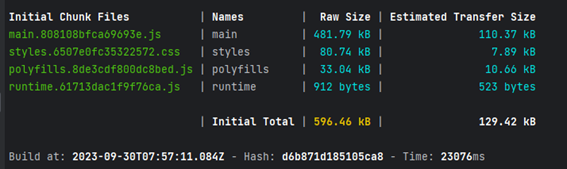

# 5.2.2.3. Development Evidence for Sprint Review

En este sprint, para poder hacer el deploy de TechShops, se utilizó Firebase. El proceso incluyó la instalación de Firebase, la autenticación y la inicialización en el directorio de nuestro proyecto

Configuramos el host:

En la consola de WebStorm, ejecutamos el comando "npm run build" para generar los archivos necesarios que Firebase utilizará para realizar la implementación. 

Una vez completado el proceso de implementación, abrimos el dominio correspondiente: 

Adicionalmente, el proyecto se ha cargado en un repositorio de GitHub para facilitar las actualizaciones subsiguientes.

