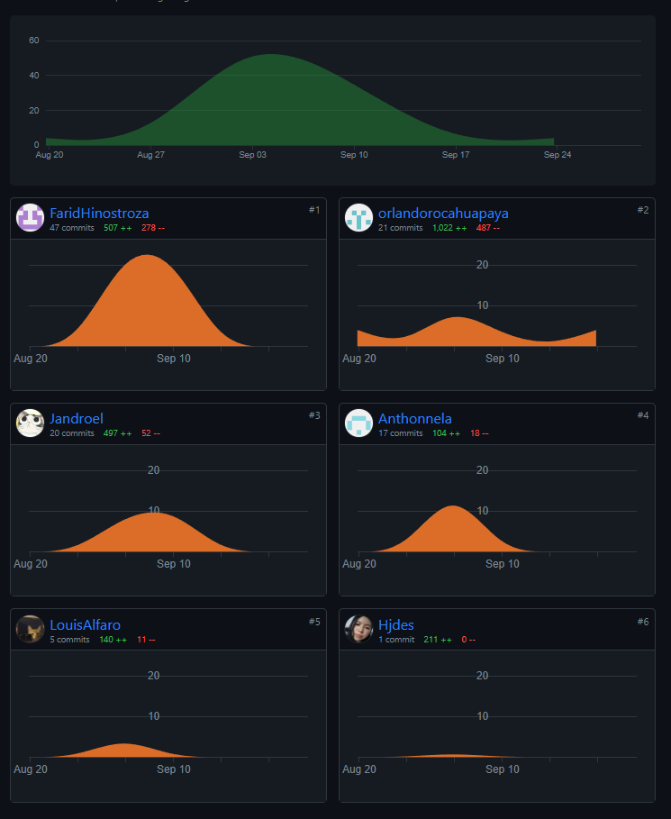

# 5.2.2.8. Team Collaboration Insights during Sprint.
Team Collaboration Insights engloba una diversidad de datos e información que ofrece un análisis sobre la dinámica de colaboración y trabajo en equipo de un grupo. Esto puede abarcar métricas como la frecuencia de comunicación, los niveles de participación, el avance del proyecto, entre otros aspectos. Hasta el momento, estos datos se han recopilado hasta el final del segundo sprint.

