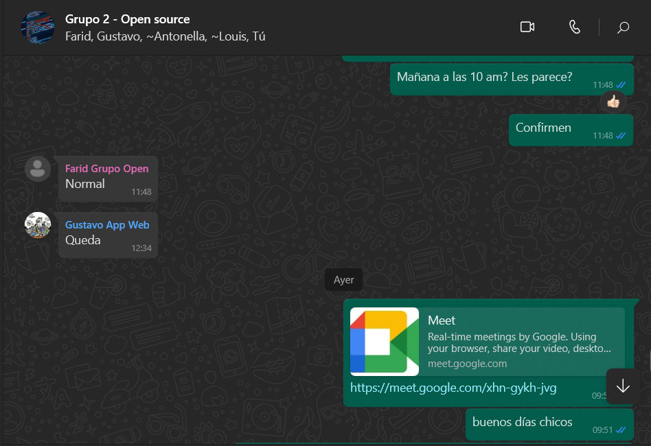

# Carátula

**Universidad:** Universidad Peruana de Ciencias Aplicadas

**Carrera:** Ingeniería de software

**Curso:** Desarrollo de Aplicaciones Open Source

**Sección:** SW55

**Informe de Trabajo Final**

**Profesor:** Hugo Allan Mori Paiva

**Nombre del Startup:** NanoNerds

**Nombre del Producto:** TechShop

**Integrantes:**
- Orlando Arturo Roca Huapaya - u201919742
- Farid Rolando Hinostroza Mavila - u202014468
- Louis Piero Alfaro Coveñas - u20191b299
- Antonella Frida Gonzales Gomez - u20211c403

**Ciclo:** 2023-02

**Mes:** Setiembre

# Registro de Versiones del Informe

| Versión | Fecha      | Autor   | Descripción de modificación                                     |
|---------|------------|---------|-----------------------------------------------------------------|
| TB1     | 21-08-2023 | Orlando | Se crearon los archivos md del capitulo 1 y 2 en el repositorio |
| TB1     | 09-09-2023 | Louis   | Avance el capitulo 2 y 4 en el repositorio                      |
| TB1     | 09-09-2023 | Orlando | Avance el capitulo 1, 2 y 3 en el repositorio                   |
| TB1     | 08-09-2023 | Antonella | Avance el capitulo 1, y 5 en el repositorio                   |

# Project Report Collaboration Insights 

[Enlace al Repositorio del Informe en GitHub](https://github.com/NanoNerdsGroup/NanoNerds-Report.git)

| Commit ID | Autor   | Fecha      | Descripción del Commit                          |
|-----------|---------|------------|-----------------------------------------------|
|e1c2ae2aaf4e4bebc9bcbbc3735131e8f9db7662| Orlando | 21-08-2023 | chore: Initial repository setup - Setting up the project structure and initializing the repository.|
|1194fd4e070ed6f7a4e21d90a04bf135c80c607a| Orlando | 21-08-2023 | chore: Add initial files for team to start working - Included the necessary files in the chapter 1 for the team to begin working on the assigned task|
|746ab558314266c63a4d54f581242b4eb60506b9| Orlando | 21-08-2023 |chore: Add initial files for team to start working - Included the necessary files in the chapter 2 for the team to begin working on the assigned task|
|cad53628381fa3bbd01b186e2e63305c7ee37e85| Louis   | 09-09-2023 |doc: As-is-Scenario-Mapping, Empathy-Mapping, User-Journey-Mapping added                                                                                                                                                     |
|859f290a360ac940dd594d2fd5d7fb7d179c9e04| Louis   | 09-09-2023 |doc: Software Architecture Context Diagram, Software Architecture Container Diagrams, Software Architecture Components Diagrams added                                                                                                                                                     |
|2651227a287c63ac50234204a6650104dd84f764|Orlando|09-09-2023|doc: Canvas, Target Segment and Team members profile added|
|829cec314671610d0025d3215d39e5f54d88a245|Orlando|09-09-2023|doc: Competitive analysis, Competitors and strategies and tactics against competitos added|
|8770ca25d5b57886f85c143394bd8017c7c1492c|Orlando|09-09-2023|Landing page and Architecture information parts added|
|4a4538f7c137f24d34992cf582b5f2cce14c6ac7|Orlando|09-09-2023|doc: class diagram, class dictionary and database diagram added|

### Actividades:
- fecha: 20-08-2023

Durante una reunión de google meet hemos elegido una idea para nuestra startup. Abarcamos temas como el nombre de la startup y el sector en el que ibamos a trabajar, al final de la reunión elegimos el sector de tecnología.

# Contenido

- [Capítulo I: Introducción]()
  - [1.1. Startup Profile]()
    - [1.1.1. Descripción de la Startup]()
    - [1.1.2. Perfiles de integrantes del equipo]()
  - [1.2. Solution Profile]()
    - [1.2.1. Antecedentes y problemática]()
    - [1.2.2. Lean UX Process]()
      - [1.2.2.1. Lean UX Problem Statements]()
      - [1.2.2.2. Lean UX Assumptions]()
      - [1.2.2.3. Lean UX Hypothesis Statements]()
      - [1.2.2.4. Lean UX Canvas]()
    - [1.3. Segmentos objetivo]()

- [Capítulo II: Requirements Elicitation & Analysis]()
  - [2.1. Competidores]()
    - [2.1.1. Análisis competitivo]()
    - [2.1.2. Estrategias y tácticas frente a competidores]()
  - [2.2. Entrevistas]()
    - [2.2.1. Diseño de entrevistas]()
    - [2.2.2. Registro de entrevistas]()
    - [2.2.3. Análisis de entrevistas]()
  - [2.3. Needfinding]()
    - [2.3.1. User Personas]()
    - [2.3.2. User Task Matrix]()
    - [2.3.3. User Journey Mapping]()
    - [2.3.4. Empathy Mapping]()
    - [2.3.5. As-is Scenario Mapping]()

- [Capítulo III: Requirements Specification]()
  - [3.1. To-Be Scenario Mapping]()
  - [3.2. User Stories]()
  - [3.3. Impact Mapping]()
  - [3.4. Product Backlog]()

- [Capítulo IV: Product Design]()
  - [4.1. Style Guidelines]()
    - [4.1.1. General Style Guidelines]()
    - [4.1.2. Web Style Guidelines]()
  - [4.2. Information Architecture]()
    - [4.2.1. Organization Systems]()
    - [4.2.2. Labeling Systems]()
    - [4.2.3. SEO Tags and Meta Tags]()
    - [4.2.4. Searching Systems]()
    - [4.2.5. Navigation Systems]()
  - [4.3. Landing Page UI Design]()
    - [4.3.1. Landing Page Wireframe]()
    - [4.3.2. Landing Page Mock-up]()
  - [4.4. Web Applications UX/UI Design]()
    - [4.4.1. Web Applications Wireframes]()
    - [4.4.2. Web Applications Wireflow Diagrams]()
    - [4.4.3. Web Applications Mock-ups]()
    - [4.4.4. Web Applications User Flow Diagrams]()
  - [4.5. Web Applications Prototyping]()
  - [4.6. Domain-Driven Software Architecture]()
    - [4.6.1. Software Architecture Context Diagram]()
    - [4.6.2. Software Architecture Container Diagrams]()
    - [4.6.3. Software Architecture Components Diagrams]()
  - [4.7. Software Object-Oriented Design]()
    - [4.7.1. Class Diagrams]()
    - [4.7.2. Class Dictionary]()
  - [4.8. Database Design]()
    - [4.8.1. Database Diagram]()

- [Capítulo V: Product Implementation, Validation & Deployment]()
  - [5.1. Software Configuration Management]()
    - [5.1.1. Software Development Environment Configuration]()
    - [5.1.2. Source Code Management]()
    - [5.1.3. Source Code Style Guide & Conventions]()
    - [5.1.4. Software Deployment Configuration]()
  - [5.2. Landing Page, Services & Applications Implementation]()
    - [5.2.X. Sprint n]()
      - [5.2.X.1. Sprint Planning n]()
      - [5.2.X.2. Sprint Backlog n]()
      - [5.2.X.3. Development Evidence for Sprint Review]()
      - [5.2.X.4. Testing Suite Evidence for Sprint Review]()
      - [5.2.X.5. Execution Evidence for Sprint Review]()
      - [5.2.X.6. Services Documentation Evidence for Sprint Review]()
      - [5.2.X.7. Software Deployment Evidence for Sprint Review]()
      - [5.2.X.8. Team Collaboration Insights during Sprint]()
  - [5.3. Validation Interviews]()
    - [5.3.1. Diseño de Entrevistas]()
    - [5.3.2. Registro de Entrevistas]()
    - [5.3.3. Evaluaciones según heurísticas]()
  - [5.4. Video About-the-Product]()

- [Conclusiones]()
  - [Conclusiones y recomendaciones]()
  - [Video About-the-Team]()

- [Bibliografía]()
- [Anexos]()

# Student Outcome

# Capítulo I: Introducción 

## 1.1. Startup Profile 

### 1.1.1. Descripción de la Startup 

TechShop es una plataforma innovadora que tiene como objetivo simplificar y mejorar la forma en que las personas diseñan y personalizan sus propias PCs y laptops. En nuestro enfoque centrado en el usuario, proporcionamos a los usuarios la capacidad de definir requisitos específicos para su sistema a través de un cuestionario interactivo. Por ejemplo, si desean un sistema para juegos de alto rendimiento o para tareas intensivas de edición de video, TechShop procesa esta información y ofrece recomendaciones precisas de componentes que garantizan un rendimiento óptimo para cada caso de uso.

En lugar de brindar asesoramiento directo, TechShop capacita a los usuarios para que tomen decisiones informadas en función de sus necesidades. Nuestra plataforma conecta a los usuarios con una lista cuidadosamente seleccionada de componentes recomendados y establecimientos confiables donde pueden adquirirlos a precios competitivos. Además, ofrecemos a las tiendas de componentes de hardware la oportunidad de registrarse y exhibir sus productos a una audiencia comprometida con la tecnología.

Visión: Ser líder global en la personalización de PCs y laptops, ofreciendo una experiencia única y accesible para crear sistemas tecnológicos que se adapten a las necesidades de cada individuo.

Misión: Facilitar la creación de tecnología personalizada al brindar recomendaciones precisas de componentes y conectar a los usuarios con opciones confiables de compra, transformando así la manera en que las personas interactúan con la tecnología

### 1.1.2. Perfiles de integrantes del equipo 

Soy Louis Piero Alfaro Coveñas, soy estudiante de la UPC en la carrera de ingenieria de Software. Cuento con el conocimiento de diversos lenguajes HTML,java, C++, C# y MySQL. Ya tengo experiencia creando páginas con los modelos C4
<tr>
    <td style="border: 1px solid #dddddd; padding: 8px;">
      

    </td>
  </tr>
 

Como estudiante de ingeniería de software, mi contribución al equipo se centra en mis conocimientos en la planificación y diseño de software. A lo largo de mi formación, he tenido la oportunidad de desarrollar proyectos utilizando Java, lo que me brinda una ventaja significativa con el desarrollo del sistema que estamos trabajando. Estoy entusiasmado por aplicar mis habilidades en el desarrollo y trabajar junto al equipo para alcanzar nuestros objetivos.

<tr>
    <td style="border: 1px solid #dddddd; padding: 8px;">
      

    </td>
  </tr>
 

Soy Antonella Frida Gonzales Gomez, como estudiante de la carrera de Ingeniería de Software, contribuiré al equipo mis conocimientos fundamentales en algunos lenguajes de programación. Estos conocimientos me permitirán participar activamente en la creación y desarrollo de proyectos además tengo un enfoque responsable hacia mi trabajo y tareas asignadas. Entiendo la importancia de cumplir con plazos y metas establecidas, lo que contribuye al flujo de trabajo del equipo y al éxito general del proyecto.
<tr>
<tr>
    <td style="border: 1px solid #dddddd; padding: 8px;">
        

    </td>
</tr>

## 1.2. Solution Profile 

### 1.2.1  Antecedentes y problemática 

### 1.2.2 Lean UX Process. 

#### 1.2.2.1. Lean UX Problem Statements. 

- **PS1:**
 Objetivos actuales del producto: Simplificar la experiencia de personalización de PCs y laptops al brindar recomendaciones precisas de componentes y opciones de compra confiables.

  Problema: Los clientes que buscan comprar componentes para personalizar sus sistemas enfrentan dificultades al comprender las especificaciones técnicas de los productos disponibles. Esto puede llevar a compras inadecuadas y un rendimiento insatisfactorio en sus sistemas personalizados.

  Pregunta solicitud de mejora: ¿Cómo podemos proporcionar a los clientes información clara sobre las especificaciones técnicas de los componentes para ayudarles a tomar decisiones de compra más informadas y optimizar el rendimiento de sus sistemas personalizados?

- **PS2:**
Objetivos actuales del producto: Conectar a los usuarios con tiendas de componentes confiables y brindar a los vendedores la oportunidad de exhibir sus productos a una audiencia comprometida con la tecnología.

  Problema: Algunos vendedores de componentes se enfrentan a dificultades para destacar sus productos entre una amplia gama de opciones en el mercado, lo que limita su visibilidad y la capacidad de destacar las ventajas únicas de sus ofertas.

  Pregunta solicitud de mejora: ¿Cómo podemos desarrollar soluciones que permitan a los vendedores presentar sus productos de manera más atractiva y destacar sus características diferenciales en la plataforma, para así fomentar su participación y diversificar las opciones disponibles para nuestros usuarios?

#### 1.2.2.2. Lean UX Assumptions. 

#### 1.2.2.3. Lean UX Hypothesis Statements. 

La finalidad de esta idea de negocio es brindar a todas las personas con falta de conocimiento de pc, herramientas que les ayude a informarse sobre componentes y armado de sus pc deseadas.

**Hipótesis de negocio:**

- Creemos que, si iniciamos dando la bienvenida, preguntar qué desea hacer (comprar o renovar), para qué objetivo será usado, resolveremos sus dudas y daremos un mejor servicio. Sabremos que hemos tenido éxito, cuando no tengamos comentarios negativos en el interfaz de usuario.

- Creemos que al publicar nuestros servicios por medio de las redes sociales nos dará más clientes. Sabremos que hemos tenido éxito, cuando más del 60% vengan con un código de descuento.

**Hipótesis del Usuario:**

- Creemos que al proporcionar recomendaciones personalizadas de componentes a los clientes según sus necesidades específicas, mejoraremos su capacidad para tomar decisiones de compra informadas y maximizar el rendimiento de sus sistemas personalizados.

  Sabremos que hemos tenido éxito

  Cuando observemos que el 75% de los usuarios recibieron recomendaciones personalizadas en comparación con aquellos que no lo hicieron. Esto indicará que los usuarios encuentran valor en las recomendaciones y están más propensos a realizar compras en base a ellas.

- Creemos que al ofrecer una lista de tiendas confiables con opciones competitivas de componentes, incrementaremos la confianza de los clientes en la calidad de los productos disponibles y en la transparencia de los precios.

  Sabremos que hemos tenido éxito

  Cuando observemos un aumento del 40% en las reseñas positivas sobre la confiabilidad de las tiendas y la calidad de los productos en la plataforma. Esto indicará que los usuarios están experimentando un mayor nivel de satisfacción y confianza al realizar compras a través de TechShop.

- Creemos que al permitir a los vendedores exhibir sus productos de manera atractiva en TechShop, aumentaremos su visibilidad y, en última instancia, su volumen de ventas.

  Sabremos que hemos tenido éxito

  Cuando observemos un aumento del 30% en la cantidad de clics y visitas a las páginas de productos exhibidos por los vendedores. Esto indicará que los usuarios están explorando más a fondo las ofertas de los vendedores, lo que sugiere un mayor interés y participación.

#### 1.2.2.4. Lean UX Canvas. 

1.2.2.4. Lean UX Canvas.

|
**Business Problem**

●         Buscamos dar recomendaciones a las personas que tienen poco conocimiento de los componentes de las pc o laptops

●         Gente que desconoce sobre el funcionamiento o para qué empleamos los componentes.
|
**Solution**

●        En base al conocimiento de  expertos en armado de componentes, se desarrolla una búsqueda selectiva.

●        Ofrecer componentes de acuerdo con el rango de presupuesto

●        Algoritmo de respuesta con un almacenamiento de respuestas

** 
|
**Business Outcomes**

●        El valor fundamental que el usuario buscará en nuestra página es el encontrar   la compra ideal de componentes para  pc o laptops con seguridad de conseguir precios justos y económicos
|
| :-: | :-: | :-: |
|
**Users**

●        Personas entre 18 a 30 años
|** |
`    `**User Outcomes & Benefits**

●        Las personas realizarán compras útiles

●         Confianza en su compra
|
|
**Hypothesis**

** 

●         Creemos que si damos una interfaz de usuario a nuestra página será más llamativo y fácil para el usuario.

●        Creemos que si nos aliamos con otras tiendas nos dará más ingresos con la publicidad

●        Creemos que si promocionamos nuestra página por las distintas redes sociales aumentará el uso de esta.

|
**What is the most important thing we to learn first?**

** 

●        Conocer el sector sector y la ubicación donde realizan más compras de componentes

●        Conocer las temporadas de compra de pc/laptops.

●        Conocer el presupuesto de los usuarios de acuerdo con sus ubicaciones

 
|
**What is the least amount of work we need to do to learn the next most important thing?**

** 

●        Hacer un estudio de mercado de los sectores

●        Realizar el algoritmo de acuerdo con las selecciones de los usuarios

●         Buscar marcas y tiendas aliadas
|

## 1.3. Segmentos objetivo. 

1.3. Segmentos objetivo.

**Usuario 1: Usuarios que buscan soluciones confiables y sencillas para comprar componentes de PC o laptops según sus necesidades únicas.**

**Geográficas:**

Ubicación: Perú

Lugar de residencia: Perú

**Demográficas:**

Sexo: Hombres o Mujeres

Edad: 15 años a mas

**Psicográficas:**

Clase social: Todas las clases sociales

Estilo de vida: Persona que necesite una nueva PC o Laptop, para que puedan trabajar con las tecnologías del momento

**Conductuales:**

Conocimientos: Manejo de dispositivos tecnologicos con conexión a internet.

Actitudes: Componentes o la creación de tu propia PC o laptop, todo a los mejores precios del mercado.

**Usuario 2: Personas interesadas en ofrecer sus componentes de PC y laptops en una plataforma que amplifique su visibilidad y alcance a una audiencia apasionada por la tecnología.**

**Geográficas:**

Ubicación: Operando en Perú.

Área de alcance: Toda la geografía peruana.

**Demográficas:**

Sexo: Hombres y Mujeres.

Edad: 18 años en adelante.

**Psicográficas:**

Objetivos: Deseo de aumentar las ventas y llegar a un público diverso y comprometido con la tecnología.

Valores: Interés en ofrecer productos de alta calidad y diferenciados.

**Conductuales:**

Experiencia: Experiencia en la venta de componentes de tecnología.

Intereses: Interés en mostrar productos de manera atractiva en una plataforma dedicada a la tecnología.

