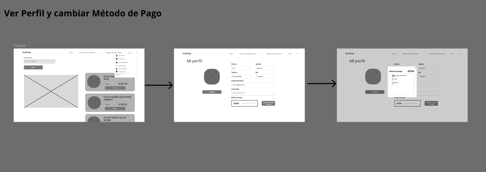
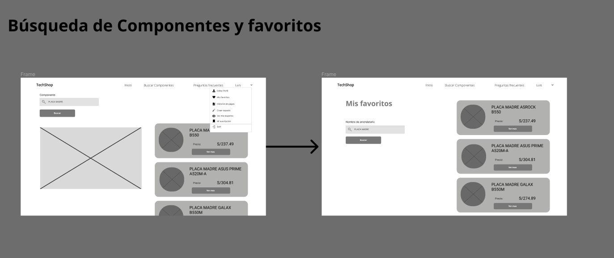
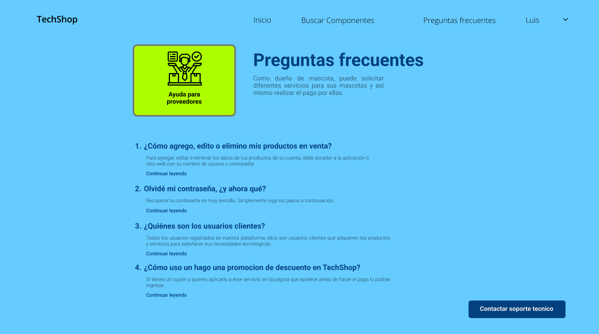
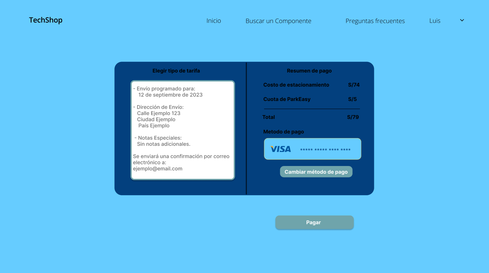

<tr>
    <td style="border: 1px solid #dddddd; padding: 8px;">
      <center></center>
    </td>
  </tr>
<br>

**Universidad:** Universidad Peruana de Ciencias Aplicadas

**Carrera:** Ingeniería de software

**Curso:** Desarrollo de Aplicaciones Open Source

**Sección:** SW55

**Informe de Trabajo Final**

**Profesor:** Hugo Allan Mori Paiva

**Nombre del Startup:** NanoNerds

**Nombre del Producto:** TechShop

**Integrantes:**
- Orlando Arturo Roca Huapaya - u201919742
- Farid Rolando Hinostroza Mavila - u202014468
- Louis Piero Alfaro Coveñas - u20191b299
- Antonella Frida Gonzales Gomez - u20211c403
- Gustavo Jandroel Aguirre Rodriguez - u202124162

**Ciclo:** 2023-02

**Mes:** Setiembre


# Registro de Versiones del Informe

| Versión | Fecha      | Autor   | Descripción de modificación                                     |
|---------|------------|---------|-----------------------------------------------------------------|
| TB1     | 21-08-2023 | Orlando | Se crearon los archivos md del capitulo 1 y 2 en el repositorio |
| TB1     | 09-09-2023 | Louis   | Avance el capitulo 2 y 4 en el repositorio                      |
| TB1     | 09-09-2023 | Orlando | Avance el capitulo 1, 2 y 3 en el repositorio                   |
| TB1     | 08-09-2023 | Antonella | Avance el capitulo 1, y 5 en el repositorio                   |
|TB1| 08-09-2023|Gustavo|Avance del capitulo 2 y 4 en el repositorio|
|TB1| 08-09-2023|Farid|Avance del capitulo 1 y 3 en el repositorio|
|TB1| 09-09-2023|Farid|Avance del capitulo 3, cambios en estimación de story points en el repositorio|
|TP| 30-09-2023|Farid|Avance de user stories en app web, frontend actualizado|
|TP| 30-09-2023|Farid|Mejoras en Documentos de sprint anterior|


# Project Report Collaboration Insights 

[Enlace al Repositorio del Informe en GitHub](https://github.com/NanoNerdsGroup/NanoNerds-Report.git)


| Commit ID | Autor   | Fecha      | Descripción del Commit                                                                                                                               |
|-----------|---------|------------|------------------------------------------------------------------------------------------------------------------------------------------------------|
|e1c2ae2aaf4e4bebc9bcbbc3735131e8f9db7662| Orlando | 21-08-2023 | chore: Initial repository setup - Setting up the project structure and initializing the repository.                                                  |
|1194fd4e070ed6f7a4e21d90a04bf135c80c607a| Orlando | 21-08-2023 | chore: Add initial files for team to start working - Included the necessary files in the chapter 1 for the team to begin working on the assigned task |
|746ab558314266c63a4d54f581242b4eb60506b9| Orlando | 21-08-2023 | chore: Add initial files for team to start working - Included the necessary files in the chapter 2 for the team to begin working on the assigned task |
|cad53628381fa3bbd01b186e2e63305c7ee37e85| Louis   | 09-09-2023 | doc: As-is-Scenario-Mapping, Empathy-Mapping, User-Journey-Mapping added                                                                             |
|859f290a360ac940dd594d2fd5d7fb7d179c9e04| Louis   | 09-09-2023 | doc: Software Architecture Context Diagram, Software Architecture Container Diagrams, Software Architecture Components Diagrams added                |
|2651227a287c63ac50234204a6650104dd84f764| Orlando | 09-09-2023 | doc: Canvas, Target Segment and Team members profile added                                                                                           |
|829cec314671610d0025d3215d39e5f54d88a245| Orlando | 09-09-2023 | doc: Competitive analysis, Competitors and strategies and tactics against competitos added                                                           |
|8770ca25d5b57886f85c143394bd8017c7c1492c| Orlando | 09-09-2023 | Landing page and Architecture information parts added                                                                                                |
|4a4538f7c137f24d34992cf582b5f2cce14c6ac7| Orlando | 09-09-2023 | doc: class diagram, class dictionary and database diagram added                                                                                      |
|9d359303769f0a685720263d94cd3c2d51854f78| Gustavo | 09-09-23   | doc: interview analysis added                                                                                                                        |
|e2b06beaa55b397b9d949a57c1c9eebe34632a0b| Gustavo | 09-09-2023 | doc: interview record added                                                                                                                          |
|81c82cf12b7654dd3c19755effe9ad1b2a46da03| Gustavo | 09-09-2023 | interviuw-record added                                                                                                                               |
|2bc4c299542ff2b2d5fbe2504e510c3b27c595cc| Gustavo | 09-09-2023 | interview images ad0des                                                                                                                              |
|48951439f83ee0065f5d8baf58258b6d0856f46f| Gustavo | 09-09-2023 | doc: Images and Web-Applications-wireframes added                                                                                                    |
|d5bcb707c331ecb9db103314957cfb3974a7ab5f| Gustavo | 09-09-2023 | doc: Web-Applications-Wireflows-Diagrams added                                                                                                       |
|833c24f1cf4ffc085b5873b83e9711bce3e00f03| Gustavo | 09-09-2023 | doc: Web Applications Wireframes and images added                                                                                                    |
|85fe6ffce3d839f859f1243cd96ec27e6ca71161| Gustavo | 09-09-2023 | doc: modified images                                                                                                                                 |
|13b6dd749cc235280b475285c14cc8b294ec1e7b| Gustavo | 09-09-2023 | doc: Web Applications User Flow Diagrams added                                                                                                       |
|a416a20228e7bfbe76678949d1528ec57be3b13e| Farid   | 09-09-2023 | doc: update impact mapping                                                                                                                           |
|8e23a2097ce4cbde7c6dd57eb47996a473270c20| Farid   | 10-09-2023 | doc: fix productbacklog bug                                                                                                                          |
|41346ac9fdc98c588d5d3a3c62b1ad621ab525ce| Gustavo | 10-09-2023 | doc: Web Applications Prototyping added                                                                                                              |
|aee61d20a2faeb17f86f4567198bbd24bfeeb53a| Farid   | 10-09-2023 | doc: about-the-team added                                                                                                                            |
|dc5a09c799ccc44546c5e602cf2aa053179f763b| Farid   | 10-09-2023 | doc: about-the-product added                                                                                                                         |
|5fb664ab5a1ba14d76549aeb798aaf0167a845ba| Farid   | 10-09-2023 | doc: footer                                                                                                                                          |
|bba11e695f46e4d494cadbfdb09ff1f4635fa56a| Farid   | 29-09-2023 | doc: updateInforme                                                                                                                                   |
|a74f748a9a07485c9e7afb626823ab3dfd2721cf| Louis   | 29-09-2023 | doc: add update new C4                                                                                                                               |

### Actividades:
- fecha: 20-08-2023


Durante una reunión de google meet hemos elegido una idea para nuestra startup. Abarcamos temas como el nombre de la startup y el sector en el que ibamos a trabajar, al final de la reunión elegimos el sector de tecnología.


# Contenido

- [Capítulo I: Introducción](#capitulo-1)
  - [1.1. Startup Profile](#11-startup-profile)
    - [1.1.1. Descripción de la Startup](#111-descripción-de-la-startup)
    - [1.1.2. Perfiles de integrantes del equipo](#112-perfiles-de-integrantes-del-equipo)
  - [1.2. Solution Profile](#12-solution-profile)
    - [1.2.1. Antecedentes y problemática](#121-antecedentes-y-problemática)
    - [1.2.2. Lean UX Process](#122-lean-ux-process)
      - [1.2.2.1. Lean UX Problem Statements](#1221-lean-ux-problem-statements)
      - [1.2.2.2. Lean UX Assumptions](#1222-lean-ux-assumptions)
      - [1.2.2.3. Lean UX Hypothesis Statements](#1223-lean-ux-hypothesis-statements)
      - [1.2.2.4. Lean UX Canvas](#1224-lean-ux-canvas)
    - [1.3. Segmentos objetivo](#13-segmentos-objetivo)

- [Capítulo II: Requirements Elicitation & Analysis](#capítulo-ii-requirements-elicitation--analysis)
  - [2.1. Competidores](#21-competidores)
    - [2.1.1. Análisis competitivo](#211-análisis-competitivo)
    - [2.1.2. Estrategias y tácticas frente a competidores](#212-estrategias-y-tácticas-frente-a-competidores)
  - [2.2. Entrevistas](#22-entrevistas)
    - [2.2.1. Diseño de entrevistas](#221-diseño-de-entrevistas)
    - [2.2.2. Registro de entrevistas](#222-registro-de-entrevistas)
    - [2.2.3. Análisis de entrevistas](#223-análisis-de-entrevistas)
  - [2.3. Needfinding](#23-needfinding)
    - [2.3.1. User Personas](#231-user-personas)
    - [2.3.2. User Task Matrix](#232-user-task-matrix)
    - [2.3.3. User Journey Mapping](#233-user-journey-mapping)
    - [2.3.4. Empathy Mapping](#234-empathy-mapping)
    - [2.3.5. As-is Scenario Mapping](#235-as-is-scenario-mapping)

- [Capítulo III: Requirements Specification](#capítulo-ii-requirements-specification)
  - [3.1. To-Be Scenario Mapping](#31-to-be-scenario-mapping)
  - [3.2. User Stories](#32-user-stories)
  - [3.3. Impact Mapping](#33-impact-mapping)
  - [3.4. Product Backlog](#34-product-backlog)

- [Capítulo IV: Product Design](#capítulo-iv-product-design)
  - [4.1. Style Guidelines](#41-style-guidelines)
    - [4.1.1. General Style Guidelines](#411-general-style-guidelines)
    - [4.1.2. Web Style Guidelines](#412-web-style-guidelines)
  - [4.2. Information Architecture](#42-information-architecture)
    - [4.2.1. Organization Systems](#421-organization-systems)
    - [4.2.2. Labeling Systems](#422-labeling-systems)
    - [4.2.3. SEO Tags and Meta Tags](#423-seo-tags-and-meta-tags)
    - [4.2.4. Searching Systems](#424-searching-systems)
    - [4.2.5. Navigation Systems](#425-navigation-systems)
  - [4.3. Landing Page UI Design](#43-landing-page-ui-design)
    - [4.3.1. Landing Page Wireframe](#431-landing-page-wireframe)
    - [4.3.2. Landing Page Mock-up](#432-landing-page-mock-up)
  - [4.4. Web Applications UX/UI Design](#44-web-applications-uxui-design)
    - [4.4.1. Web Applications Wireframes](#441-web-applications-wireframes)
    - [4.4.2. Web Applications Wireflow Diagrams](#442-web-applications-wireflow-diagrams)
    - [4.4.3. Web Applications Mock-ups](#443-web-applications-mock-ups)
    - [4.4.4. Web Applications User Flow Diagrams](#444web-applications-user-flow-diagrams)
  - [4.5. Web Applications Prototyping](#45-web-applications-prototyping)
  - [4.6. Domain-Driven Software Architecture](#46-domain-driven-software-architecture)
    - [4.6.1. Software Architecture Context Diagram](#461-software-architecture-context-diagram)
    - [4.6.2. Software Architecture Container Diagrams](#462-software-architecture-container-diagrams)
    - [4.6.3. Software Architecture Components Diagrams](#463-software-architecture-components-diagrams)
  - [4.7. Software Object-Oriented Design](#47-software-object-oriented-design)
    - [4.7.1. Class Diagrams](#471-class-diagrams)
    - [4.7.2. Class Dictionary](#472-class-dictionary)
  - [4.8. Database Design](#48-database-design)
    - [4.8.1. Database Diagram](#481-database-diagram)

- [Capítulo V: Product Implementation, Validation & Deployment](#1)
  - [5.1. Software Configuration Management](#2)
    - [5.1.1. Software Development Environment Configuration](#3)
    - [5.1.2. Source Code Management](#4)
    - [5.1.3. Source Code Style Guide & Conventions](#5)
    - [5.1.4. Software Deployment Configuration](#6)
  - [5.2. Landing Page, Services & Applications Implementation](#7)
    - [5.2.1. Sprint 1](#8)
      - [5.2.1.1. Sprint Planning 1](#9)
      - [5.2.1.2. Sprint Backlog 1](#10)
      - [5.2.1.3. Development Evidence for Sprint Review](#11)
      - [5.2.1.4. Testing Suite Evidence for Sprint Review](#12)
      - [5.2.1.5. Execution Evidence for Sprint Review](#13)
      - [5.2.1.6. Services Documentation Evidence for Sprint Review](#14)
      - [5.2.1.7. Software Deployment Evidence for Sprint Review](#15)
      - [5.2.1.8. Team Collaboration Insights during Sprint](#16)
    - [5.2.2. Sprint 2](#17)
      - [5.2.2.1. Sprint Planning 2](#18)
      - [5.2.2.2. Sprint Backlog 2](#19)
      - [5.2.2.3. Development Evidence for Sprint Review](#20)
      - [5.2.2.4. Testing Suite Evidence for Sprint Review](#21)
      - [5.2.2.5. Execution Evidence for Sprint Review](#22)
      - [5.2.2.6. Services Documentation Evidence for Sprint Review](#23)
      - [5.2.2.7. Software Deployment Evidence for Sprint Review](#24)
      - [5.2.2.8. Team Collaboration Insights during Sprint](#25)
  - [5.3. Validation Interviews](#26)
    - [5.3.1. Diseño de Entrevistas](#27)
    - [5.3.2. Registro de Entrevistas](#28)
    - [5.3.3. Evaluaciones según heurísticas](#29)
  - [5.4. Video About-the-Product](#30)

- [Conclusiones](#31)
  - [Conclusiones y recomendaciones](#32)
  - [Video About-the-Team](#33)

- [Bibliografía](#34)
- [Anexos](#35)

# Student Outcome

| **Criterio específico**                                                                                                                                                                                              | **Acciones realizadas**                                                                                                                                                                                                                                                                                                                                                                                                                                                                                                                                                                                                                                                                                                                                                                                                                                                                                                                                                                                                                                                                                                                                                                                                                                                                                                                                                                                             | **Conclusiones**                                                                                                                         |
|:---------------------------------------------------------------------------------------------------------------------------------------------------------------------------------------------------------------------|:--------------------------------------------------------------------------------------------------------------------------------------------------------------------------------------------------------------------------------------------------------------------------------------------------------------------------------------------------------------------------------------------------------------------------------------------------------------------------------------------------------------------------------------------------------------------------------------------------------------------------------------------------------------------------------------------------------------------------------------------------------------------------------------------------------------------------------------------------------------------------------------------------------------------------------------------------------------------------------------------------------------------------------------------------------------------------------------------------------------------------------------------------------------------------------------------------------------------------------------------------------------------------------------------------------------------------------------------------------------------------------------------------------------------|:-----------------------------------------------------------------------------------------------------------------------------------------|
| <p>**Participa en equipos** </p><p>**multidisciplinarios con eficacia,** </p><p>**eficiencia y objetividad, en el** </p><p>**marco de un proyecto en** </p><p>**soluciones de ingeniería de** </p><p>**software.**</p>| <p>**Orlando Arturo Roca Huapaya**</p><p>**TB1**</p><p>En esta entrega me encargue de realizar revisiones oportunas en el trabajo para realizar un correcto desarrollo del TB1. Asimismo, participe en el desarrollo de la idea de negocio</p><p></p><p>**Gonzales Gomez, Antonella**</p><p>**TB1**</p><p>` `Para el desarrollo del proyecto, se tuvo que identificar un problema o una necesidad latente, nuestro startup resuelve la necesidad de dos segmentos de usuarios, a través de las diferentes funcionalidades de nuestra aplicación.</p><p></p><p>**Aguirre Rodríguez, Gustavo Jandroel**</p><p>**TB1**</p><p>En el proceso, tuve que identificar las funciones esenciales del aplicativo y analizar el pensamiento del público objetivo para guiar la creación del diseño del web application.</p><p></p><p>**Louis Piero Alfaro Coveñas**</p><p>**TB1**</p><p>En esta entrega tuve que ver con que software me ayudaría para realizar el capítulo 2 del trabajo y analizar cómo lo que nuestro sistema embarca y con qué lenguaje pensaba programar el diseño de la estructura de nuestro sistema</p><p>**Louis Piero Alfaro Coveñas**</p><p></p> <p>**TP**</p><p>Me encargue de pasar el proyecto del markdown a word con todas las correcciones respectivas</p>                                                                                                                                     |                                                                                                                                          |<br>|
| <p>**Conoce al menos un sector** </p><p>**empresarial o dominio de** </p><p>**aplicación de soluciones de** </p><p>**software.**</p>                                                                                 | <p>**Orlando Arturo Roca Huapaya**</p><p>**TB1**</p><p>Me encargue de realizar el analisis competitivo, los wireframes y mock-ups de la landing page, el diagrama de clases y el diagrama de base de datos</p><p></p><p>**Gonzales Gomez, Antonella**</p><p>**TB1**</p><p>` `Me encargue de la gestión de la configuración del software y de las herramientas utilizadas en diferentes aspectos del proyecto. Estas herramientas abarcan desde la gestión de proyectos hasta el desarrollo, pruebas, documentación y despliegue del software. </p><p></p><p>**Aguirre Rodríguez, Gustavo Jandroel**</p><p>**TB1**</p><p>En este trabajo, mi responsabilidad abarcó el diseño de entrevistas, la recolección y análisis de datos, así como la creación de diseños en Figma para la aplicación web. Además, utilicé Lucidchart para confeccionar diagramas relevantes.</p><p>**Louis Piero Alfaro Coveñas**</p><p>**TB1**</p><p>Me encargue de los Customer Journey Mapping, Empathy Mapping, As-is Scenario Mapping</p><p>como también de DOMAIN-DRIVEN SOFTWARE ARCHITECTURE. </p> </p><p>**Farid Hinostroza Mavila**</p><p>**TB1**</p><p>Me encargue de las historias de usuario y product backlog, a su vez, definiciones en el capitulo I</p><p>diseño de la edición del video  </p> </p><p>**Louis Piero Alfaro Coveñas**</p><p></p> <p>**TP**</p><p>Me encargue de hacer una mejora a los C4 del proyecto </p> |||


# Capítulo I: Introducción <a name="capitulo-1"></a>

## 1.1. Startup Profile <a name="11-startup-profile"></a>

### 1.1.1. Descripción de la Startup <a name="111-descripción-de-la-startup"></a>

TechShop es una plataforma innovadora que tiene como objetivo simplificar y mejorar la forma en que las personas diseñan y personalizan sus propias PCs y laptops. En nuestro enfoque centrado en el usuario, proporcionamos a los usuarios la capacidad de definir requisitos específicos para su sistema a través de un cuestionario interactivo. Por ejemplo, si desean un sistema para juegos de alto rendimiento o para tareas intensivas de edición de video, TechShop procesa esta información y ofrece recomendaciones precisas de componentes que garantizan un rendimiento óptimo para cada caso de uso.

En lugar de brindar asesoramiento directo, TechShop capacita a los usuarios para que tomen decisiones informadas en función de sus necesidades. Nuestra plataforma conecta a los usuarios con una lista cuidadosamente seleccionada de componentes recomendados y establecimientos confiables donde pueden adquirirlos a precios competitivos. Además, ofrecemos a las tiendas de componentes de hardware la oportunidad de registrarse y exhibir sus productos a una audiencia comprometida con la tecnología.

Visión: Ser líder global en la personalización de PCs y laptops, ofreciendo una experiencia única y accesible para crear sistemas tecnológicos que se adapten a las necesidades de cada individuo.

Misión: Facilitar la creación de tecnología personalizada al brindar recomendaciones precisas de componentes y conectar a los usuarios con opciones confiables de compra, transformando así la manera en que las personas interactúan con la tecnología

### 1.1.2. Perfiles de integrantes del equipo <a name="112-perfiles-de-integrantes-del-equipo"></a>

Soy Louis Piero Alfaro Coveñas, soy estudiante de la UPC en la carrera de ingenieria de Software. Cuento con el conocimiento de diversos lenguajes HTML,java, C++, C# y MySQL. Ya tengo experiencia creando páginas con los modelos C4
<tr>
    <td style="border: 1px solid #dddddd; padding: 8px;">
      <center></center>
    </td>
  </tr>
<br>

Como estudiante de ingeniería de software, mi contribución al equipo se centra en mis conocimientos en la planificación y diseño de software. A lo largo de mi formación, he tenido la oportunidad de desarrollar proyectos utilizando Java, lo que me brinda una ventaja significativa con el desarrollo del sistema que estamos trabajando. Estoy entusiasmado por aplicar mis habilidades en el desarrollo y trabajar junto al equipo para alcanzar nuestros objetivos.

<tr>
    <td style="border: 1px solid #dddddd; padding: 8px;">
      <center></center>
    </td>
  </tr>
<br>


Soy Antonella Frida Gonzales Gomez, como estudiante de la carrera de Ingeniería de Software, contribuiré al equipo mis conocimientos fundamentales en algunos lenguajes de programación. Estos conocimientos me permitirán participar activamente en la creación y desarrollo de proyectos además tengo un enfoque responsable hacia mi trabajo y tareas asignadas. Entiendo la importancia de cumplir con plazos y metas establecidas, lo que contribuye al flujo de trabajo del equipo y al éxito general del proyecto.
<tr>
<tr>
    <td style="border: 1px solid #dddddd; padding: 8px;">
        <center></center>
    </td>
</tr>


Como estudiante de la carrera de Ingeniería de Software, brindaré mis conocimientos tanto de programación como diseño a mi equipo. Escogí esta carrera porque me encanta la tecnología y me mantiene actualizado en todo momento.

<tr>
    <td style="border: 1px solid #dddddd; padding: 8px;">
      <center></center>
    </td>
  </tr>
<br>

Soy Farid Hinostroza Mavila, escogí la carrera de Ingeniería de Software por mi gran interés en la tecnología y su avance continuo, me motivan a aprender y ser autodidacta.
<tr>
    <td style="border: 1px solid #dddddd; padding: 8px;">
      <center></center>
    </td>
  </tr>
<br>


## 1.2. Solution Profile <a name="12-solution-profile"></a>

### 1.2.1  Antecedentes y problemática <a name="121-antecedentes-y-problemática"></a>


### 1.2.2 Lean UX Process. <a name="122-lean-ux-process"></a>

#### 1.2.2.1. Lean UX Problem Statements. <a name="1221-lean-ux-problem-statements"></a>

- **PS1:**
 Objetivos actuales del producto: Simplificar la experiencia de personalización de PCs y laptops al brindar recomendaciones precisas de componentes y opciones de compra confiables.

  Problema: Los clientes que buscan comprar componentes para personalizar sus sistemas enfrentan dificultades al comprender las especificaciones técnicas de los productos disponibles. Esto puede llevar a compras inadecuadas y un rendimiento insatisfactorio en sus sistemas personalizados.

  Pregunta solicitud de mejora: ¿Cómo podemos proporcionar a los clientes información clara sobre las especificaciones técnicas de los componentes para ayudarles a tomar decisiones de compra más informadas y optimizar el rendimiento de sus sistemas personalizados?

- **PS2:**
Objetivos actuales del producto: Conectar a los usuarios con tiendas de componentes confiables y brindar a los vendedores la oportunidad de exhibir sus productos a una audiencia comprometida con la tecnología.

  Problema: Algunos vendedores de componentes se enfrentan a dificultades para destacar sus productos entre una amplia gama de opciones en el mercado, lo que limita su visibilidad y la capacidad de destacar las ventajas únicas de sus ofertas.

  Pregunta solicitud de mejora: ¿Cómo podemos desarrollar soluciones que permitan a los vendedores presentar sus productos de manera más atractiva y destacar sus características diferenciales en la plataforma, para así fomentar su participación y diversificar las opciones disponibles para nuestros usuarios?


#### 1.2.2.2. Lean UX Assumptions. <a name="1222-lean-ux-assumptions"></a>


#### 1.2.2.3. Lean UX Hypothesis Statements. <a name="1223-lean-ux-hypothesis-statements"></a>


La finalidad de esta idea de negocio es brindar a todas las personas con falta de conocimiento de pc, herramientas que les ayude a informarse sobre componentes y armado de sus pc deseadas.

**Hipótesis de negocio:**

- Creemos que, si iniciamos dando la bienvenida, preguntar qué desea hacer (comprar o renovar), para qué objetivo será usado, resolveremos sus dudas y daremos un mejor servicio. Sabremos que hemos tenido éxito, cuando no tengamos comentarios negativos en el interfaz de usuario.

- Creemos que al publicar nuestros servicios por medio de las redes sociales nos dará más clientes. Sabremos que hemos tenido éxito, cuando más del 60% vengan con un código de descuento.

**Hipótesis del Usuario:**

- Creemos que al proporcionar recomendaciones personalizadas de componentes a los clientes según sus necesidades específicas, mejoraremos su capacidad para tomar decisiones de compra informadas y maximizar el rendimiento de sus sistemas personalizados.

  Sabremos que hemos tenido éxito

  Cuando observemos que el 75% de los usuarios recibieron recomendaciones personalizadas en comparación con aquellos que no lo hicieron. Esto indicará que los usuarios encuentran valor en las recomendaciones y están más propensos a realizar compras en base a ellas.

- Creemos que al ofrecer una lista de tiendas confiables con opciones competitivas de componentes, incrementaremos la confianza de los clientes en la calidad de los productos disponibles y en la transparencia de los precios.

  Sabremos que hemos tenido éxito

  Cuando observemos un aumento del 40% en las reseñas positivas sobre la confiabilidad de las tiendas y la calidad de los productos en la plataforma. Esto indicará que los usuarios están experimentando un mayor nivel de satisfacción y confianza al realizar compras a través de TechShop.


- Creemos que al permitir a los vendedores exhibir sus productos de manera atractiva en TechShop, aumentaremos su visibilidad y, en última instancia, su volumen de ventas.

  Sabremos que hemos tenido éxito

  Cuando observemos un aumento del 30% en la cantidad de clics y visitas a las páginas de productos exhibidos por los vendedores. Esto indicará que los usuarios están explorando más a fondo las ofertas de los vendedores, lo que sugiere un mayor interés y participación.


#### 1.2.2.4. Lean UX Canvas. <a name="1224-lean-ux-canvas"></a>

|<p>**Business Problem**</p><p>●         Buscamos dar recomendaciones a las personas que tienen poco conocimiento de los componentes de las pc o laptops</p><p></p><p>●         Gente que desconoce sobre el funcionamiento o para qué empleamos los componentes.</p>|<p>**Solution**</p><p>●        En base al conocimiento de  expertos en armado de componentes, se desarrolla una búsqueda selectiva.</p><p></p><p>●        Ofrecer componentes de acuerdo con el rango de presupuesto</p><p></p><p>●        Algoritmo de respuesta con un almacenamiento de respuestas</p><p>** </p>|<p>**Business Outcomes**</p><p>●        El valor fundamental que el usuario buscará en nuestra página es el encontrar   la compra ideal de componentes para  pc o laptops con seguridad de conseguir precios justos y económicos</p>|
| :-: | :-: | :-: |
|<p>**Users**</p><p>●        Personas entre 18 a 30 años</p>|** |<p>`    `**User Outcomes & Benefits**</p><p>●        Las personas realizarán compras útiles</p><p>●         Confianza en su compra</p>|
|<p>**Hypothesis**</p><p>** </p><p>●         Creemos que si damos una interfaz de usuario a nuestra página será más llamativo y fácil para el usuario.</p><p></p><p>●        Creemos que si nos aliamos con otras tiendas nos dará más ingresos con la publicidad</p><p></p><p>●        Creemos que si promocionamos nuestra página por las distintas redes sociales aumentará el uso de esta.</p><p></p>|<p>**What is the most important thing we to learn first?**</p><p>** </p><p>●        Conocer el sector sector y la ubicación donde realizan más compras de componentes</p><p></p><p>●        Conocer las temporadas de compra de pc/laptops.</p><p></p><p>●        Conocer el presupuesto de los usuarios de acuerdo con sus ubicaciones</p><p> </p>|<p>**What is the least amount of work we need to do to learn the next most important thing?**</p><p>** </p><p>●        Hacer un estudio de mercado de los sectores</p><p></p><p>●        Realizar el algoritmo de acuerdo con las selecciones de los usuarios</p><p></p><p>●         Buscar marcas y tiendas aliadas</p>|

## 1.3. Segmentos objetivo. <a name="13-segmentos-objetivo"></a>

**Usuario 1: Usuarios que buscan soluciones confiables y sencillas para comprar componentes de PC o laptops según sus necesidades únicas.**

**Geográficas:**

Ubicación: Perú

Lugar de residencia: Perú

**Demográficas:**

Sexo: Hombres o Mujeres

Edad: 15 años a mas

**Psicográficas:**

Clase social: Todas las clases sociales

Estilo de vida: Persona que necesite una nueva PC o Laptop, para que puedan trabajar con las tecnologías del momento

**Conductuales:**

Conocimientos: Manejo de dispositivos tecnologicos con conexión a internet.

Actitudes: Componentes o la creación de tu propia PC o laptop, todo a los mejores precios del mercado.


**Usuario 2: Personas interesadas en ofrecer sus componentes de PC y laptops en una plataforma que amplifique su visibilidad y alcance a una audiencia apasionada por la tecnología.**

**Geográficas:**

Ubicación: Operando en Perú.

Área de alcance: Toda la geografía peruana.

**Demográficas:**

Sexo: Hombres y Mujeres.

Edad: 18 años en adelante.

**Psicográficas:**

Objetivos: Deseo de aumentar las ventas y llegar a un público diverso y comprometido con la tecnología.

Valores: Interés en ofrecer productos de alta calidad y diferenciados.

**Conductuales:**

Experiencia: Experiencia en la venta de componentes de tecnología.

Intereses: Interés en mostrar productos de manera atractiva en una plataforma dedicada a la tecnología.

# Capítulo II: Requirements Elicitation & Analysis <a name="capítulo-ii-requirements-elicitation--analysis"></a>

## 2.1. Competidores. <a name="21-competidores"></a>

**PCPartPicker:** Es una plataforma en línea que permite a los usuarios seleccionar componentes para construir su propia PC. Ofrece comparaciones de precios, compatibilidad de componentes y opciones personalizadas.

**Newegg:** Es un minorista en línea de productos electrónicos y hardware de computadoras. Ofrece una amplia gama de componentes y dispositivos tecnológicos, además de reseñas y calificaciones de usuarios.

**Amazon:** El gigante del comercio electrónico también ofrece una gran variedad de componentes de PC y laptops. Los usuarios pueden comparar precios y opciones de productos, leer reseñas y aprovechar la logística de entrega rápida.

### 2.1.1. Análisis competitivo. <a name="211-análisis-competitivo"></a>

<table><tr><th colspan="6" valign="top">Competitive Analysis Landscape</th></tr>
<tr><td colspan="2" rowspan="2" valign="top"><p>¿Por qué llevar a cabo</p><p>este análisis?</p></td><td colspan="4" valign="top">Objetivo del análisis</td></tr>
<tr><td colspan="4" valign="top"><p>¿Cómo analiza, produce y enfrenta el mercado mi</p><p>competencia?</p></td></tr>
<tr><td colspan="2" valign="top">Startup</td><td valign="top">TechShop</td><td valign="top">PCPartPicker</td><td valign="top">Newegg</td><td valign="top">Amazon</td></tr>
<tr><td colspan="2" valign="top">Logo</td><td valign="top"> </td><td valign="top"> </td><td valign="top"> </td><td valign="top"> </td></tr>
<tr><td rowspan="2" valign="top">Perfil</td><td valign="top">Overview</td><td valign="top">Plataforma de personalización de PCs y laptops con recomendaciones personalizadas.</td><td valign="top">Plataforma para seleccionar y construir PCs personalizadas.</td><td valign="top">Minorista en línea de productos electrónicos, hardware y accesorios.</td><td valign="top">Mayor plataforma de comercio electrónico con una amplia gama de productos.</td></tr>
<tr><td valign="top">Ventaja competitiva ¿Qué valor ofrece a los clientes?</td><td valign="top"><p>Ofrece recomendaciones de componentes personalizadas para optimizar el rendimiento.</p><p>Permite a los usuarios tomar decisiones informadas al comprar componentes.</p></td><td valign="top"><p>Plataforma interactiva para comparar precios y componentes.</p><p>Facilita la construcción de PCs con componentes compatibles.</p></td><td valign="top"><p>Variedad de productos electrónicos y acceso a reseñas.</p><p>Ofrece una amplia gama de productos tecnológicos en un solo lugar.</p></td><td valign="top"><p>Amplia selección de productos con entrega rápida y comodidad.</p><p>Proporciona conveniencia y opciones para diferentes necesidades.</p></td></tr>
<tr><td rowspan="2" valign="top">Perfil de Marketing</td><td valign="top">Mercado Objetivo</td><td valign="top">Usuarios de todas las edades en Perú que desean componentes personalizados para PCs y laptops.</td><td valign="top">Usuarios de tecnología interesados en construir PCs personalizadas.</td><td valign="top">Consumidores en busca de productos tecnológicos y electrónicos.</td><td valign="top">Diversos consumidores que buscan productos electrónicos y más allá.</td></tr>
<tr><td valign="top">Estrategias de Marketing</td><td valign="top"><p>Utiliza plataformas de redes sociales como Facebook e Instagram para promocionar recomendaciones personalizadas y conexiones con tiendas confiables.</p><p>Implementa una campaña de marketing de contenido, ofreciendo guías detalladas sobre cómo elegir componentes según diferentes necesidades</p><p></p></td><td valign="top"><p>Ofrece webinars y tutoriales en línea sobre cómo construir PCs utilizando PCPartPicker, fomentando la educación y la comunidad.</p><p>Utiliza publicidad en línea en sitios web de tecnología y foros especializados para destacar la funcionalidad de la plataforma.</p><p></p></td><td valign="top"><p>Realiza campañas de marketing por correo electrónico para informar a los clientes sobre ofertas especiales, lanzamientos de productos y ventas exclusivas.</p><p>Destaca la garantía de calidad y reseñas de productos para construir confianza entre los compradores.</p><p></p></td><td valign="top"><p>Implementa un enfoque de marketing global con anuncios en línea y sociales para llegar a un público diverso.</p><p>Colabora con marcas tecnológicas líderes para destacar sus productos en la plataforma y atraer a los consumidores.</p><p></p></td></tr>
<tr><td rowspan="3" valign="top">Perfil de Producto</td><td valign="top">Productos & Servicios</td><td valign="top">Recomendaciones personalizadas de componentes para PCs y laptops.</td><td valign="top">Plataforma interactiva para seleccionar y comparar componentes.</td><td valign="top">Amplia gama de productos electrónicos, hardware y accesorios.</td><td valign="top">Diversa selección de productos electrónicos y de otras categorías.</td></tr>
<tr><td valign="top">Precios & Costos</td><td valign="top">Conexiones con tiendas que ofrecen precios competitivos en componentes.</td><td valign="top">Comparación de precios de componentes en múltiples tiendas en línea.</td><td valign="top">Precios variados en función de la calidad y la marca.</td><td valign="top">Amplia gama de precios y opciones, desde económicas hasta premium.</td></tr>
<tr><td valign="top">Canales de Distribución</td><td valign="top">Plataforma en línea que conecta usuarios con tiendas de componentes.</td><td valign="top">Plataforma en línea que destaca las opciones de componentes y tiendas.</td><td valign="top">Plataforma en línea con opciones de envío a domicilio.</td><td valign="top">Amplia red de distribución con opciones de envío y entrega.</td></tr>
<tr><td rowspan="4" valign="top">Análisis SWOT</td><td valign="top">Fortalezas</td><td valign="top">Recomendaciones personalizadas, conexión con tiendas, enfoque en experiencia del usuario.</td><td valign="top">Interfaz interactiva, comparación de precios, enfoque en personalización.</td><td valign="top">Variedad de productos, opciones de envío, reseñas de usuarios.</td><td valign="top">Amplia gama de productos, conveniencia, programas de membresía.</td></tr>
<tr><td valign="top">Debilidades</td><td valign="top">Dependencia de colaboraciones con tiendas, competencia en el mercado.</td><td valign="top">Enfocado en público específico, competencia en la industria.</td><td valign="top">Posibles variaciones en calidad, competencia con otros minoristas en línea.</td><td valign="top">Posible saturación de opciones, competencia en varias categorías.</td></tr>
<tr><td valign="top">Oportunidades</td><td valign="top">Crecimiento en la demanda de personalización tecnológica, expansión a otras regiones.</td><td valign="top">Mayor interés en construcción de PCs, diversificación de servicios.</td><td valign="top">Mayor demanda de productos electrónicos, mejora de la experiencia del usuario.</td><td valign="top">Continuo crecimiento del comercio electrónico, expansión global.</td></tr>
<tr><td valign="top">Amenazas</td><td valign="top">Cambios en las preferencias del consumidor, competidores emergentes.</td><td valign="top">Cambios en la tecnología, fluctuación en la demanda de componentes.</td><td valign="top">Competencia con otras tiendas en línea, fluctuaciones en la economía.</td><td valign="top">Competencia intensa, regulaciones cambiantes en el comercio electrónico.</td></tr>
</table>

### 2.1.2. Estrategias y tácticas frente a competidores. <a name="212-estrategias-y-tácticas-frente-a-competidores"></a>

TechShop debe centrarse en destacar su propuesta única de simplificación y personalización de la compra de componentes tecnológicos. Esta estrategia no solo facilita la adquisición de componentes de alta calidad, sino que también garantiza que los clientes obtengan los productos adecuados para sus necesidades específicas.

Para diferenciarse de la competencia, debemos enfocarnos en campañas de marketing personalizadas que aborden las necesidades individuales de los compradores. Comunicar cómo TechShop resuelve problemas y ofrece beneficios adaptados a cada usuario ayudará a atraer y retener a clientes satisfechos. La constante mejora de la plataforma y las asociaciones estratégicas con marcas líderes en tecnología son esenciales para mantenernos en la vanguardia. Desarrollar nuevas características y colaborar con fabricantes de componentes consolidará la posición de TechShop en la industria de la venta de componentes tecnológicos.

En resumen, debemos centrarnos en la diferenciación estratégica a través de la simplificación y personalización de la compra de componentes tecnológicos. Garantizar una experiencia de usuario excepcional y dirigir el marketing de manera personalizada serán clave para atraer a clientes. La innovación continua y las colaboraciones estratégicas fortalecerán nuestra posición competitiva en el mercado.

## 2.2. Entrevistas. <a name="22-entrevistas"></a>
### 2.2.1. Diseño de entrevistas. <a name="221-diseño-de-entrevistas"></a>

**Segmento Objetivo 1: Usuario 1 (Customer): Usuarios que buscan soluciones confiables y sencillas para comprar componentes de PC o laptops según sus necesidades únicas.**

**Introducción y Presentación:**

- Saludo y presentación.
- ¿Cuál es tu nombre?
- ¿Qué edad tienes?
- ¿Cuál es tu ocupación profesional?
- Explicación del propósito de la entrevista y cómo se utilizará la información recopilada.

**Preguntas Clave:**

- ¿Con qué frecuencia utilizas dispositivos de tecnología, como PC o laptops?
- Explicación del propósito de la entrevista y cómo se utilizará la información recopilada.
- ¿Tienes conocimiento respecto a los componentes de una computadora/laptop?
- Cuando compraste tu pc/laptop lograste conseguir lo que buscabas?
- ¿Te sentiste confundido o desconocías sobre ciertas especificaciones y sus diferencias al momento de comprar un equipo?
- ¿Sientes que hiciste una mala compra al elegir una computadora/laptop?
- ¿Te brindaron la asesoría correcta al momento de tu compra?
- ` `¿Lograste entender sobre los requerimientos y el porqué de la diferencia de precios?
- ¿Piensas que debería existir alguna herramienta para casos como el tuyo?
- ¿Te sientes seguro al comprar tecnología por internet?
- ¿Pagarías una membresía para la asesoría de este problema?

**Cierre y Agradecimiento:**

Agradecimiento por su participación.


**Segmento Objetivo 2: Usuario 2 (Seller): Personas interesadas en ofrecer sus componentes de PC y laptops.**

**Introducción y Presentación:**

- Saludo y presentación.
- ¿Cuál es tu nombre?
- ¿Qué edad tienes?
- ¿Cuál es tu ocupación profesional?
- Explicación del propósito de la entrevista y cómo se utilizará la información recopilada.

**Preguntas Clave:**

- ¿Desde hace cuánto te dedicas al tema de ventas en este rubro?
- ¿Sientes que en el contexto de esta pandemia afectó el rendimiento de tu negocio?
- ¿Cuánto crees que es el conocimiento de tus clientes al momento de preguntar sobre componentes?
- ¿Sientes que compran lo que realmente buscan o no se sienten tan familiarizados?
- ¿Viste en tu entorno estafas respecto a las ventas de pc’s/laptops?
- ¿Consideras que debería existir más interés respecto a lo que hay detrás de cada computadora?
- ¿Si tu respuesta es sí, en qué aspecto?
- ¿Consideras que una aplicación web, pueda solucionar los problemas con respecto a la elección de componentes y su asesoría?
- ¿Qué características te gustaría que tenga esta aplicación web?
- ¿Buscarías una alianza con la app? 
- ¿Cómo ves a futuro el crecimiento en la asesoría para la compra de componentes?


**Cierre y Agradecimiento:**

Agradecimiento por su participación.

### 2.2.2. Registro de entrevistas. <a name="222-registro-de-entrevistas"></a>

**Customers**

**Registro de entrevista N° 1:** 

**Fecha: 01/09/23**

**Nombres y Apellidos:** Joe Medina

**Edad:** 23 años 

**Duración de la entrevista: 0:10 - 02:22 min**


**Link: <https://upcedupe-my.sharepoint.com/:v:/g/personal/u202124162_upc_edu_pe/EecBmvMVpMhFqRzcLdvGh98B61H-soEkSiTYUMZ-rz8cbA?e=ye136l>** 

**Resumen de la entrevista:** 

Jhoe, un joven de 23 años que estudia Administración en la Universidad Nacional Mayor de San Marcos y reside en San Martín de Porres, nos comparte su experiencia al comprar una laptop. Él cuenta que a pesar de tener conocimientos básicos sobre computadoras, Jtuvo dificultades para encontrar una laptop que cumpliera con sus requerimientos específicos.

Cuando los vendedores le explicaron las características técnicas, Jhoe admitió que no entendía completamente, aunque recibió una buena asesoría. Destacó la importancia de tener una guía o herramienta que facilite la comprensión de los componentes de una laptop. En cuanto a las compras en línea, Jhoe mencionó que estaría dispuesto a pagar en una página web si esta es segura. 

**Registro de entrevista N° 2:** 

**Fecha: 31/08/23**

**Nombres y Apellidos:** Yeline Arce

**Edad:** 23 años 

**Duración de la entrevista: 02:30 – 4:30 min**


**Link: <https://upcedupe-my.sharepoint.com/:v:/g/personal/u202124162_upc_edu_pe/EecBmvMVpMhFqRzcLdvGh98B61H-soEkSiTYUMZ-rz8cbA?e=ye136l>**

**Resumen de la entrevista:** 

Yeline Arce, una estudiante de 23 años de la UPC, cursando la carrera de periodismo, compartió su experiencia en la compra de una PC. A pesar de tener conocimientos básicos de computadoras, inicialmente tuvo algunas dudas. Sin embargo, logró ensamblar su PC con la ayuda de un técnico que le proporcionó recomendaciones sobre los componentes más adecuados. Durante este proceso, pudo comprender los requisitos necesarios y la lógica detrás de los precios de los componentes. A pesar de su éxito en la compra, Yeline admitió que no se siente completamente segura al realizar compras en línea. Además, mencionó que la experiencia de compra en línea difiere significativamente de la compra presencial.

**Registro de entrevista N° 3:** 

**Fecha: 01/09/23**

**Nombres y Apellidos:** Aracely Nunuvero

**Edad:** 22 años 

**Duración de la entrevista: 4:32 – 6:08 min**


**Link: <https://upcedupe-my.sharepoint.com/:v:/g/personal/u202124162_upc_edu_pe/EecBmvMVpMhFqRzcLdvGh98B61H-soEkSiTYUMZ-rz8cbA?e=ye136l>**

**Resumen de la entrevista:** 

Aracely, una estudiante de 22 años de la Universidad Nacional Mayor de San Marcos, en estudiando Turismo, compartió sus experiencias en la búsqueda de una PC o laptop. A pesar de su interés, Aracely tiene conocimientos limitados en tecnología y se sintió perdida al interactuar con vendedores que utilizaban un lenguaje técnico que no podía comprender completamente. Aracely expresó un deseo de contar con una herramienta que le ayude a comprender mejor las especificaciones técnicas de los productos. 

En cuanto a las compras en línea, Aracely está dispuesta a realizar pagos en línea siempre que la página le brinde la confianza necesaria. Esto refleja su disposición a adoptar tecnologías digitales, siempre y cuando se sienta segura al hacerlo.

**Sellers**

**Registro de entrevista N° 4:** 

**Fecha: 25/08/23**

**Nombres y Apellidos:** Edwin Peche

**Edad:** 32 años 

**Duración de la entrevista: 6:16 – 9:07 min**


**Link: <https://upcedupe-my.sharepoint.com/:v:/g/personal/u202124162_upc_edu_pe/EecBmvMVpMhFqRzcLdvGh98B61H-soEkSiTYUMZ-rz8cbA?e=ye136l>**

**Resumen de la entrevista:** 

Edwin Peche, un vendedor de 32 años en SMP, con 5-6 años de experiencia en ventas, nos comenta que trabajaron por redes durante la pandemia. Sus clientes varían en conocimientos sobre componentes de computadoras, algunos requieren información. No ha observado estafas en este mercado. Destaca la importancia de mantenerse actualizado y busca una aplicación fácil y accesible. Está abierto a una posible alianza con una aplicación para mejorar su trabajo.

**Registro de entrevista N° 5:** 

**Fecha: 27/08/23**

**Nombres y Apellidos:** Tania Perez

**Edad:** 35 años 

**Duración de la entrevista: 9:13 -11:39 min**


**Link: <https://upcedupe-my.sharepoint.com/:v:/g/personal/u202124162_upc_edu_pe/EecBmvMVpMhFqRzcLdvGh98B61H-soEkSiTYUMZ-rz8cbA?e=ye136l>** 

**Resumen de la entrevista:** 

Una emprendedora de 35 años que reside en SMP y lleva 5 años en su negocio compartió sus experiencias. La pandemia tuvo un impacto, pero se están recuperando. Sus clientes varían en su conocimiento de productos, y en su mayoría, quedan satisfechos con sus compras. No ha detectado estafas en las ventas. Destaca la importancia de mantenerse al tanto de los cambios tecnológicos. Busca una aplicación fácil y accesible, sin botones innecesarios. Está interesada en aliarse con una aplicación que cumpla con estas características.

**Registro de entrevista N° 6:** 

**Fecha: 02/09/23**

**Nombres y Apellidos:** Leonardo Ventura

**Edad:** 22 años 

**Duración de la entrevista: 9:13 -11:39 min**


**Link: <https://upcedupe-my.sharepoint.com/:v:/g/personal/u202124162_upc_edu_pe/EZSEQNFxnYxFmSgzGbKmyZEBKKh5o8_69im2NNJSUDdJqw?e=cSisW7>** 

**Resumen de la entrevista:** 

Durante la entrevista con Leonardo, un vendedor experimentado de componentes de computadora con 5 años de experiencia, se observan dos aspectos cruciales. Primero, los compradores muestran un creciente conocimiento previo sobre los componentes, lo que resalta la importancia de orientar las estrategias hacia la educación del cliente y la transparencia en las ventas. Segundo, Leonardo expresa preocupación por estafas en el mercado de componentes y muestra disposición a probar una plataforma web de ventas, señalando una oportunidad para abordar la seguridad y autenticidad en las transacciones en línea.

### 2.2.3. Análisis de entrevistas. <a name="223-análisis-de-entrevistas"></a>

**Análisis de la entrevista N° 1 Joe Medina:** 

Joe Medina fue nuestro primer entrevistado y respondió a todas nuestras preguntas con gran interés. En cuanto a las preguntas relacionadas con la creación de una plataforma web para ayudar en la elección de una PC, sus respuestas estuvieron alineadas con nuestras expectativas. Principalmente, expresó su desconocimiento al comprar su PC y las diferencias que enfrentó al adquirirla, aunque logró entender los conceptos básicos y tuvo dificultades con detalles específicos y las variaciones de precios. Joe considera útil la idea de nuestra aplicación, ya que resolvería su situación y estaría dispuesto a pagar una membresía siempre y cuando sea confiable.

**Análisis de la entrevista N° 2 Yeline Arce:** 

Yeline explicó sus necesidades y preferencias con respecto a la elección de una PC y afirmó que había comprendido en términos generales las especificaciones y requisitos. Cuando se le mencionó la posibilidad de una aplicación web para recibir asesoramiento, mostró interés, pero expresó cierta inseguridad al comprar componentes en línea debido a la falta de la experiencia de ver el ensamblaje en tiempo real. Sin embargo, no descartó la idea para el futuro.

**Análisis de la entrevista N° 3 Aracely Nunuvero:** 

Aracely reveló tener un conocimiento limitado sobre los componentes de una PC o laptop, aunque comprendía lo básico y lo que necesitaba buscar. Sin embargo, enfrentó dificultades con la jerga técnica y los términos tecnológicos. Está dispuesta a pagar una membresía en una aplicación web que le ofrezca soluciones a su falta de conocimiento en tecnología, siempre y cuando esta sea confiable y segura.

**Análisis de la entrevista N° 4 Edwin Peche:** 

Edwin es nuestro experto con más de 5 años de experiencia en la venta de componentes. Él compartió su conocimiento sobre sus clientes, divididos en dos categorías: los experimentados en tecnología que saben lo que necesitan y los usuarios comunes que requieren más asesoramiento. Además, considera que debería haber un mayor interés en componentes y tecnología en general, dado que el campo de la informática está en constante evolución. Edwin enfatiza que las aplicaciones son prácticamente un estilo de vida para muchas personas y que, si se crea una aplicación para resolver problemas relacionados con los componentes, lo más importante sería la facilidad de uso, la experiencia del usuario y la accesibilidad para todos.

**Análisis de la entrevista N° 5 Tania Perez:** 

Tania considera que la mayoría de sus clientes quedan satisfechos con sus compras gracias a su asesoramiento. Ella respalda la idea de crear una aplicación para asesorar sobre componentes, siempre y cuando sea fácilmente accesible para cualquier usuario. Tania cree que esta aplicación también podría beneficiarla a ella, ya que ningún experto puede saber todo sobre informática y mantenerse actualizado es crucial.

**Análisis de la entrevista N° 6 Leonardo Ventura:** 

La entrevista con Leonardo subraya la necesidad de adaptarse a las tendencias del mercado y abordar desafíos clave. El aumento en el conocimiento de los compradores sugiere la importancia de proporcionar contenido educativo y transparente. Por otro lado, la preocupación por estafas resalta la necesidad de mejorar la seguridad en las transacciones en línea. En resumen, se destaca la importancia de la educación del cliente y la confiabilidad en las ventas en línea de componentes de computadora.

## 2.3. Needfinding. <a name="23-needfinding"></a>
### 2.3.1. User Personas. <a name="231-user-personas"></a>

### 2.3.2. User Task Matrix. <a name="232-user-task-matrix"></a> 

| **Tareas / User Persona**                                  | **Laura Montalvo**                                       |
|-----------------------------------------------------------|---------------------------------------------------------|
| Explorar contenido sobre componentes de PC                  | Frecuencia: Alta Importancia: Media                      |
| Buscar ofertas y descuentos en tiendas asociadas            | Frecuencia: Media Importancia: Alta                      |
| Seleccionar componentes para armar una PC personalizada     | Frecuencia: Alta Importancia: Alta                       |
| Comprar componentes a través de la plataforma              | Frecuencia: Alta Importancia: Alta                       |
| Publicar detalles de los componentes que vende             | Frecuencia: Baja Importancia: Baja                       |
| Interactuar con compradores interesados                     | Frecuencia: Baja Importancia: Baja                       |
| Acceder a guías detalladas para ensamblar componentes       | Frecuencia: Media Importancia: Media                     |
| Participar en la comunidad de entusiastas tecnológicos      | Frecuencia: Baja Importancia: Baja                       |

### Tareas con Mayor Frecuencia e Importancia:


- Seleccionar componentes para armar una PC personalizada: Laura está muy interesada en elegir los componentes adecuados para construir su PC personalizada.


- Comprar componentes a través de la plataforma: La adquisición de componentes es una tarea clave para lograr su objetivo de construir su propia PC.

| **Tareas / User Persona**                              | **Luis Huerta**                                         |
|-------------------------------------------------------|--------------------------------------------------------|
| Explorar contenido sobre componentes de PC              | Frecuencia: Baja Importancia: Media                      |
| Buscar ofertas y descuentos en tiendas asociadas        | Frecuencia: Baja Importancia: Media                      |
| Seleccionar componentes para armar una PC personalizada | Frecuencia: Baja Importancia: Media                      |
| Comprar componentes a través de la plataforma          | Frecuencia: Alta Importancia: Alta                       |
| Publicar detalles de los componentes que vende         | Frecuencia: Alta Importancia: Alta                       |
| Interactuar con compradores interesados                 | Frecuencia: Alta Importancia: Alta                       |
| Acceder a guías detalladas para ensamblar componentes   | Frecuencia: Baja Importancia: Baja                       |
| Participar en la comunidad de entusiastas tecnológicos  | Frecuencia: Alta Importancia: Alta                       |


### Tareas con Mayor Frecuencia e Importancia:


- Publicar detalles de los componentes que vende: Dado que Luis busca generar ingresos a través de la plataforma, publicar detalles sobre los componentes es esencial para atraer a compradores potenciales.


- Interactuar con compradores interesados: La comunicación con los compradores interesados es crucial para cerrar ventas y generar ingresos.
 
###  Principales diferencias:
Las principales diferencias entre las dos personas se centran en sus roles en la plataforma:
- Laura, como compradora, se enfoca en la selección y compra de componentes para armar su PC personalizada.
- Luis, como proveedor, se centra en publicar detalles de los componentes que vende y en interactuar con compradores interesados.
### Principales coincidencias:
A pesar de sus roles diferentes, hay algunas coincidencias entre Laura y Luis:
Ambos están interesados en participar en la comunidad de entusiastas tecnológicos, aunque Luis lo hace desde la perspectiva de un proveedor y Laura como una entusiasta que busca información.
Ambos valoran la posibilidad de encontrar ofertas y descuentos en tiendas asociadas a través de la plataforma para ahorrar dinero en sus transacciones.

### 2.3.3. User Journey Mapping. <a name="233-user-journey-mapping"></a>

### Segmento Usuario
<tr>
    <td style="border: 1px solid #dddddd; padding: 8px;">
      
    </td>
  </tr>
<br>

### Segmento Vendedor

<tr>
    <td style="border: 1px solid #dddddd; padding: 8px;">
      
    </td>
  </tr>
<br>

### 2.3.4. Empathy Mapping. <a name="234-empathy-mapping"></a>
Con motivo de comprender con mayor precisión nuestros segmentos objetivos, en este apartado utilizaremos la herramienta Impact Map que nos permite establecer una relación entre las necesidades del usuario con las metas de nuestro proyecto, a través de: impactos y entregables. Los impactos describen qué debe hacer nuestro usuario para acercarnos más a nuestra meta, mientras que los entregables nos dicen cómo podemos ayudarlos para lograr esta meta. A continuación, se encuentran los Impact Mapping de los usuarios.
 <br> 

### Segmento Usuario
<tr>
    <td style="border: 1px solid #dddddd; padding: 8px;">
      
    </td>
  </tr>
<br>

### Segmento Vendedor

<tr>
    <td style="border: 1px solid #dddddd; padding: 8px;">
      
    </td>
  </tr>
<br>

### 2.3.5. As-is Scenario Mapping. <a name="235-as-is-scenario-mapping"></a>

### Segmento Usuario
<tr>
    <td style="border: 1px solid #dddddd; padding: 8px;">
      
    </td>
  </tr>
<br>

### Segmento Vendedor

<tr>
    <td style="border: 1px solid #dddddd; padding: 8px;">
      
    </td>
  </tr>
<br>

# Capítulo III: Requirements Specification <a name="capítulo-ii-requirements-specification"></a>

## 3.1. To-Be Scenario Mapping. <a name="31-to-be-scenario-mapping"></a>


**Usuario**


|**Phases**|**Búsqueda de tienda**|**Llamado a la tienda**|**Llegada a la tienda**|
| :-: | :-: | :-: | :-: |
|**Doing**|●        Búsqueda de alguna tienda segura y de buena calidad.|●        Llamar a la tienda y obtener información de ella, ya sea calidad de atención, precio del producto, calidad, etc.|●        Dirigirse a la tienda y pedir el producto para dar una vista previa para estar seguro de la compra.|
|**Thinking**|●        Pensar en la gran variedad de tiendas que hay. |●        Pensar en preguntar y sacar la mayor información posible de dicha tienda.|●        Pensar en la buena calidad y eficiencia de lo que se comprará.|
|**Feeling**|●        Preocupación a la hora de saber si cuenta con los productos requeridos por el cliente.|●        Ansiedad, ya que después de obtener una excelente información de sus productos, poder ir a verlos y comprobarlos.|●        Satisfacción al ver que la compra fue todo un éxito. |

*Hecho en Lucidchart*

**Experto**


|**Phases**|**Búsqueda de tienda**|**Llamado a la tienda**|**Llegada a la tienda**|
| :-: | :-: | :-: | :-: |
|**Doing**|●        Investigar sobre tiendas de computadoras.|●        Llamar a la tienda y obtener información sobre lo requerido y llegar a un acuerdo.|●        Verificar si sus productos están en buen estado y observar el ensamblaje.|
|**Thinking**|●        Encontrar tienda confiable y de buena atención.|●        Encontrar una tienda con buena atención y que cumpla sus requerimientos.|●        Verificar el rendimiento de la computadora al llegar a su domicilio.|
|**Feeling**|●        Ansioso por saber si la tienda cumple con sus expectativas.|●        Ansioso por llegar a un acuerdo con la tienda eh ir.|●        Ansioso por ver su rendimiento de la pc comprada.|

## 3.2. User Stories. <a name="32-user-stories"></a>

En esta sección redactamos las historias de usuario necesarias para el correcto funcionamiento de nuestra aplicación según las necesidades de nuestros segmentos objetivos, considerando con ello un mínimo de un criterio de aceptación para cada historia de usuario.

|<p>**Epic/User Story**</p><p>**ID**</p>|**Título**|**Descripción**|**Criterios de Aceptación**|**Relacionado con (Epic ID)**|
| :- | :- | :- | :- | :- |
|EP06/TS01|Acceder a EndPoints|Como developer **deseo** acceder a endpoints para interactuar con la aplicacion|<p>**Escenario N°1** </p><p>**Persistencia del endpoint**</p><p></p><p>**Dado que** el developer hace uso del endpoint para interactuar con la aplicación</p><p></p><p>**Y** existe la solicitud es correcta</p><p></p><p>**Entonces** el api devuelve un response con la data solicitada </p><p></p><p>**Escenario N°2:No funciona la persistencia del endpoint**</p><p></p><p>**Dado** que el Developer hace uso del endpoint para interactuar con la aplicación</p><p></p><p>**Y** existe un error en la solicitud </p><p></p>|EPIC-07|
|<p></p><p>US01</p>|Seller, proveedores disponibles|**Como** Proveedor deseo ofrecer mis componentes.|<p>**Escenario:**</p><p>**Ofrecer mis componentes para el público de  TechShop**</p><p>**Dado** que soy un proveedor, deseo ofrecer mis productos.</p><p>**Entonces**</p><p>Brindo una afiliación con TechShop para la venta en conjunto según necesidades del usuario.</p>|EPIC-05|
|US02|Registro de usuario en la aplicación|Como usuario **deseo** crear una cuenta para administrar mis servicios.|<p>**Escenario N°1** </p><p>**Crear cuenta**</p><p>**Dado** que el usuario desea crear una cuenta<br>Entonces debe seleccionar el botón “Crear cuenta”<br>Cuando lo seleccione podrá llenar los datos pedidos por la aplicación.</p><p></p><p>**Escenario N°2**</p><p>**Verificación de cuenta**</p><p>**Dado** que el usuario desea confirmar la cuenta creada<br>Entonces debe seleccionar “confirmar cuenta”</p><p>**Entonces** se le enviará un código a su correo el cual debe ingresar a la aplicación<br>**Cuando** ingrese el código podrá verificar su cuenta<br>Entonces tendrá su cuenta creada.</p><p></p>|EPIC-01|
|US03|Inicio de Sesión|Como usuario quiero iniciar sesión con la cuenta que cree para poder acceder a las funciones de la aplicación.|<p>**Escenario N°1**</p><p>**Inicio de Sesión**</p><p>**Dado** que el usuario desea acceder a la aplicación<br>**Entonces** deberá ingresar su correo y contraseña <br>Cuando los datos sean verificados por la base de datos de la aplicación el usuario podrá acceder al aplicativo y dispondrá de todas sus funcionalidades</p>|EPIC-01|
|US04|Recuperación de la cuenta|Como usuario quiero recuperar mi cuenta de la cual me olvide la contraseña o el correo, para evitar crearme otra cuenta.|<p>**Escenario N°1** </p><p>**Usuario no recuerda su contraseña**</p><p>Dado que el usuario no recuerda su contraseña<br>Entonces deberá seleccionar “¿Olvidaste tu contraseña?”</p><p><br>**Cuando** la seleccione deberá ingresar el correo de la cuenta</p><p><br>**Entonces** se le enviará un código a ese correo.</p><p></p><p>**Escenario N°2**</p><p>**Usuario recibe Código de verificación**</p><p>**Dado** que el usuario recibió el código de verificación<br>**Cuando** coloque el código en la aplicación<br>**Entonces** se habilita la opción de restablecer la contraseña.</p><p></p><p>**Escenario N°3**</p><p>**Usuario restablece su contraseña**</p><p>**Dado** que el usuario puede restablecer su contraseña<br>**Cuando** escriba dos veces su nueva contraseña</p><p>**Entonces** deberá seleccionar el botón “Confirmar contraseña”</p><p></p>|EPIC-01|
|US05|LogOut|Como usuario quiero poder desconectarme de la aplicación para evitar que otras personas usen mi cuenta.|<p>**Escenario: Usuario de la aplicación quiere desconectar su sesión de la aplicación**</p><p>**Dado**  que el usuario de la aplicación se encuentre dentro de su cuenta</p><p>Y haga click en el botón de Menú</p><p>Y haga click en “Cerrar Sesión”</p><p>**Cuando**  haga click en “Aceptar”</p><p>**Entonces** la página se direccionará al formulario de “Iniciar Sesión”</p>|EPIC-01|
|US06|Recomendación de Componentes|Como usuario **quiero** que la página me recomiende componentes según mi necesidades.|<p>**Escenario: Recomendar componentes**</p><p>**Dado** que la base de datos tiene registrado el interés el usuario</p><p>**Cuando** se pida a la base de datos recomendar componentes</p><p>**Entonces** se mostrará una serie de recomendaciones</p>|EPIC-02|
|US07|Almacenamiento de búsqueda de componentes|Como usuario quiero que mi cuenta almacene información sobre mis cotizaciones sobre componentes para mi pc.|<p>**Escenario: Usuario de aplicación almacena sus cotizaciones**</p><p></p><p>**DADO** que el usuario de la aplicación ha iniciado sesión</p><p>Y ha realizado una cotización de sus servicios requerido</p><p>**CUANDO** haga click en “Guardar Cotización”</p><p>**ENTONCES** le aparece un mensaje de “Cotización guardada satisfactoriamente”</p><p>**Escenario**: Usuario de la aplicación quiere visualizar sus cotizaciones guardadas</p><p>**DADO** que el usuario de la aplicación ha iniciado sesión</p><p>Y se encuentra en la página de inicio</p><p>**CUANDO** haga click en “Ver todas mis cotizaciones”</p><p>**ENTONCES** le aparece las cotizaciones guardadas y le dirigirá a la página de inicio</p><p></p>||
|US08|Lista de proveedores de componentes|**Como** usuario, quiero poder conocer con que marcas de proveedores esta dispuesto a comprar.|<p>**Escenario N°1: Usuario conoce marcas disponibles a adquirir**</p><p></p><p>**Dado** que el usuario ha seleccionado sus preferencias a su pc ideal.</p><p>Y ha realizado su búsqueda  </p><p>**Cuando** haga click en **“Ver proveedores”** </p><p></p><p>**Entonces** le aparece la lista de proveedores disponibles</p>|EPIC-02|
|US09|Modelos de Productos|**Como** usuario quiero que me muestren modelos de los productos que necesito|<p>**Escenario**: Recomendar componentes</p><p>**Dado** que el usuario selecciono sus preferencias</p><p></p><p>**Cuando** el usuario busque sus necesidades.</p><p></p><p>**Entonces** la base de datos le mostrará los modelos referenciales </p>|EPIC-02|
|US10|Gestionar compras del usuario |**Como** usuario quiero que coticen los componentes elegidos|<p>**Escenario**: **Precio de los Componentes**</p><p>**Dado** que el usuario está en la base de datos</p><p>**Cuando** el usuario quiera ver el precio total o parcial de un componente</p><p>**Entonces** las Base de datos le mostrará los precios</p>|EPIC-02|
|US11|Ofertas en compras de componentes|` `**Como** usuario quiero ofertas en mis compras|<p>**Escenario: Ofrecer descuentos**</p><p>**Dado** que el usuario se inscribió a premium</p><p>**Cuando** el usuario busque ofertas</p><p>**Entonces** la base de datos le mostrará ofertas en los centros aliados a los nuestros</p>|EPIC-02|
|US12|Compra de Suscripciones|**Como** usuario, **deseo** tener la opción de comprar suscripciones dentro de la aplicación para acceder a características premium y beneficios exclusivos. Esto me permitirá disfrutar de una experiencia mejorada mientras uso la aplicación.|<p>**Escenario 1:** </p><p>**Exploración de Opciones de Suscripción**</p><p>Dado que el usuario desea acceder a características premium,</p><p>Cuando acceda a la sección de "Suscripciones" o "Premium" en la aplicación,</p><p>**Entonces** se le mostrará una lista de las diferentes opciones de suscripción disponibles, incluyendo detalles sobre precios, duración y beneficios asociados.</p><p></p><p>**Escenario 2:** </p><p>**Selección de Suscripción**</p><p>**Dado** que el usuario ha explorado las opciones de suscripción,</p><p>**Cuando** seleccione una suscripción específica que desee adquirir,</p><p>**Entonces** se le dirigirá a una pantalla de confirmación de compra.</p><p></p><p>**Escenario 3:** </p><p>**Confirmación de Compra**</p><p>**Dado** que el usuario ha seleccionado una suscripción,</p><p>**Cuando** confirme la compra y complete la transacción a través de un método de pago previamente registrado o proporcione los detalles de pago requeridos,</p><p>**Entonces** se completará la compra y la suscripción se activará inmediatamente, brindando al usuario acceso a las características premium.</p><p></p><p>**Escenario 4:** </p><p>**Gestión de Suscripciones**</p><p>**Dado** que el usuario ha adquirido una suscripción,</p><p>Cuando acceda a la sección de "Gestión de Suscripciones",</p><p>Entonces podrá ver los detalles de su suscripción actual, incluyendo la fecha de vencimiento, y tendrá la opción de cancelar o modificar su suscripción en cualquier momento.</p>|EPIC-03|
|US13|Editar información del perfil|**Como** usuario, quiero tener la opción de editar la información de mi perfil para mantenerla actualizada.|<p>**Escenario 1:** </p><p>**Acceso a la Edición de Perfil**</p><p>**Dado** que el usuario desea editar su información de perfil,</p><p>**Cuando** acceda a la sección de "Perfil" o "Configuración de Cuenta" en la aplicación,</p><p>**Entonces** se le proporcionará la opción de "Editar Perfil".</p><p></p><p>**Escenario 2:** </p><p>**Edición de Datos Personales**</p><p>**Dado** que el usuario ha seleccionado "Editar Perfil",</p><p>**Cuando** modifique datos personales como nombre, dirección de correo electrónico, número de teléfono u otros campos relevantes,</p><p>**Entonces** se guardarán los cambios y se actualizará la información en el perfil.</p><p></p><p>**Escenario 3:** </p><p>**Cambio de Contraseña**</p><p>**Dado** que el usuario desea cambiar su contraseña por motivos de seguridad,</p><p>**Cuando** seleccione la opción para "Cambiar Contraseña",</p><p>**Entonces** se le solicitará que ingrese su contraseña actual y luego proporcione y confirme la nueva contraseña. Una vez confirmada, se actualizará la contraseña de la cuenta.</p>|EPIC-03|
|US14|Actualizar Métodos de Pago|**Como** usuario, quiero ser capaz de actualizar los medios de pago en mi perfil para poder añadir, actualizar o eliminar distintos métodos de pago que prefiera utilizar en la aplicación.|<p>**Escenario 1:**</p><p>**Añadir medio de pago**</p><p>**Dado** que el usuario desea añadir un medio de pago.</p><p>Cuando el usuario accede a la sección de medios de pago en su perfil.</p><p>**Entonces** el sistema muestra una lista de medios de pago disponibles para añadir, el usuario selecciona uno y proporciona la información necesaria, como número de tarjeta, fecha de vencimiento, etc. El sistema verifica que la información proporcionada sea válida y agrega el nuevo medio de pago a la lista en el perfil del usuario.</p><p></p><p>**Escenario 2:**</p><p>**Eliminar medio de pago**</p><p>**Dado** que el usuario desea eliminar un medio de pago de su perfil</p><p>**Cuando** el usuario accede a la sección de medios de pago en su perfil.</p><p>` `**Entonces** el sistema muestra la lista de medios de pago que tiene el usuario, el usuario selecciona el medio que desea eliminar y confirma que desea eliminarlo, el sistema elimina el medio de pago seleccionado de la lista en el perfil del usuario.</p>|EPIC-03|
|US15|Dejar opinión acerca del componente |Como usuario quiero hacer comentarios en los componentes comprados.|<p>**Escenario: Comentarios**</p><p>**Dado que el usuario usó nuestros servicios**</p><p>**Cuando** el usuario desee hacer comentarios a su compra</p><p>**Entonces** se abrirá una sección comentarios de acuerdo con el componente seleccionado</p>|EPIC-04|
|US16|Calificación de asistencia recibida por parte de la aplicación|**Como** usuario, quiero poder enviar mi calificación por el servicio recibido.|<p>**Escenario: Comentarios**</p><p>**Dado que el usuario usó nuestros servicios**</p><p>**Cuando** el usuario desee hacer comentarios a su compra</p><p>**Entonces** se abrirá una sección comentarios de acuerdo a su experiencia por el sitio web</p>|EPIC-04|
|US17|Obtención de Datos a través de la API|**Como** Developer quiero tener la capacidad de obtener la lista de usuarios registrados en la aplicación.|<p>**Escenario 1:** </p><p>**Obtención de la Lista de Propietarios**</p><p>Dado que soy un desarrollador que utiliza la API de TechShop,</p><p>Cuando realice una solicitud GET a la ruta "/usuarios" en la API,</p><p>Entonces recibiré una lista de usuarios registrados en la plataforma, incluyendo detalles como nombres, direcciones de correo electrónico y detalles de contacto.</p><p></p><p>**Escenario 2:** </p><p>**Obtención de la Lista de Usuarios**</p><p>Dado que estoy trabajando con la API de TechShop,</p><p>Cuando realice una solicitud GET a la ruta "/usuarios" en la API,</p><p>Entonces recibiré una lista de usuarios registrados en la aplicación, con información relevante como nombres, direcciones de correo electrónico y detalles de contacto.</p>|<p>EPIC-07</p><p></p>|
|US18|Visualización de Planes de Suscripción|**Como** usuario de la aplicación, quiero acceder a información sobre los diferentes planes de suscripción ofrecidos por TechShop.|<p>**Escenario 1:** </p><p>**Exploración de Planes de Suscripción**</p><p>Dado que soy un visitante interesado en saber más sobre los planes de suscripción de TechShop,</p><p>Cuando navegue a la sección de "Suscripciones" en el sitio web,</p><p>Entonces encontraré detalles sobre los planes disponibles, sus precios y las características incluidas en cada uno.</p>|EPIC-04|
|US19|Cambiar de Idioma a Español/Inglés|**Como** usuario quiero tener la opción de cambiar el idioma del sitio entre español e inglés.|<p>**Escenario 1:** </p><p>**Cambiar idioma a Español**</p><p>Dado que soy un usuario del sitio web y prefiero ver el contenido en español,</p><p>Cuando busque la opción de cambio de idioma en el sitio,</p><p>**Entonces** podré seleccionar "Español" y ver todo el contenido del sitio en español.</p><p></p><p>**Escenario 2:** </p><p>**Cambiar idioma a Inglés**</p><p>**Dado** que soy un usuario del sitio web y prefiero ver el contenido en inglés,</p><p>**Cuando** busque la opción de cambio de idioma en el sitio,</p><p>**Entonces** podré seleccionar "Inglés" y ver todo el contenido del sitio en Inglés.</p><p></p>|EPIC-04|
|US20|Navegación en la pagina web|**Como** usuario quiero navegar libremente por la aplicación web para dirigirme a mis necesidades.|<p>**Escenario :** </p><p>**Navegar por la pagina Web**</p><p>**Dado** que soy un usuario nuevo/constante, deseo movilizarme para acceder a las distintas funcionalidades.</p><p>**Cuando** entre a cualquier botón de la toolbar, o Inicio,</p><p>**Entonces** podré cambiar con libertad la pagina**.**</p><p></p>|EPIC-04|
|US21|Hero, inicio de proceso  de busqueda|**Como** usuario quiero iniciar con el proceso de busqueda |<p>**Escenario:** </p><p>**Iniciar la busqueda en TechShop**</p><p>**Dado**  que soy un usuario, deseo iniciar mi proceso a la elaboración de mi pc ideal,</p><p>**Entonces** podré registrar mis preferencias y necesidades.</p>|EPIC-05|
|US22|Conocer propósito de sitio web, About Us.|**Como** usuario deseo conocer el propósito del sitio web para conocer los servicios ofrecidos a los usuarios  |<p>**Escenario:**</p><p>**El usuario visualiza el landing page de TechShop**</p><p></p><p>**Dado**  que el usuario se encuentra observando la landing page</p><p>Y se dirige a las seccion de “Nosotros”.</p><p></p><p>**Entonces**</p><p>El usuario lee una descripción del problema que solucionamos</p>|EPIC-05|
|US23|Customer start|**Como** cliente deseo comprar mi pc ideal|<p>**Escenario:**</p><p>**Comprar mi pc ideal según mis requerimentos en TechShop**</p><p>**Dado** que soy un cliente, con la necesidad de comprar una pc/laptop.</p><p>Entonces inicio mi proceso en la landing con “Hero”, para ingresar mis requerimentos solicitados</p><p>**Entonces**</p><p>La aplicación me dará las mejores opciones posibles a mis necesidades, conectandome con los proveedores.</p>|EPIC-05|
|US24|About The Team|**Como** usuario deseo saber quien es el equipo de TechShop|<p>**Escenario:**</p><p>**Conocer el equipo de TechShop**</p><p>**Dado** que soy un usuario, necesito informarme por quien está conformado TechShop</p><p>**Entonces**</p><p>Al hacer click en “About The Team” podré visualizar la imagen e información de cada integrante.</p>|EPIC-06|
|US25|Footer|**Como** usuario deseo conocer más información acerca de TechShop|<p>**Escenario:**</p><p>**Saber más sobre Techshop**</p><p>**Dado** que quiero conocer más de TechShop y estar enterado de sus novedades.</p><p>**Entonces**</p><p>Al Ir al footer, podré visualizar las redes sociales de TechShop.</p><p></p>|EPIC-06|

## 3.3. Impact Mapping. <a name="33-impact-mapping"></a>

Con motivo de comprender con mayor precisión nuestros segmentos objetivos, en este apartado utilizaremos la herramienta Impact Map que nos permite establecer una relación entre las necesidades del usuario con las metas de nuestro proyecto, a través de: impactos y entregables. Los impactos describen qué debe hacer nuestro
usuario para acercarnos más a nuestra meta, mientras que los entregables nos dicen
cómo podemos ayudarlos para lograr esta meta. A continuación, se encuentran los
Impact Mapping de los usuarios.

 <br>


## 3.4. Product Backlog. <a name="34-product-backlog"></a>


||||||
| :- | :- | :- | :- | :- |
|<a name="_hlk145125425"></a>1 |EP06/TS01 |Acceder a EndPoints|Como developer deseo acceder a endpoints para interactuar con la aplicacion|6 |
|2 |US01|Seller, proveedores disponibles|Como proveedor deseo ofrecer mis componentes|7|
|3 |US02|Registro de usuario en la aplicación|Como usuario **deseo** crear una cuenta para administrar mis servicios|8 |
|4 |US03|Inicio de Sesion|Como usuario quiero iniciar sesión con la cuenta que cree para poder acceder a las funciones de la aplicación.|8|
|5 |US04 |Recuperación de la cuenta|` `Como usuario quiero recuperar mi cuenta de la cual me olvide la contraseña o el correo, para evitar crearme otra cuenta.|6|


||||||
| :- | :- | :- | :- | :- |
|6 |US-05|LogOut|Como usuario quiero poder desconectarme de la aplicación para evitar que otras personas usen mi cuenta.|7 |
|7 |US-06|Recomendación de Componentes|Como usuario **quiero** que la página me recomiende componentes según mi necesidades.|8 |
|8 |US-07 |Almacenamiento de búsqueda de componentes|Como usuario quiero que mi cuenta almacene información sobre mis cotizaciones sobre componentes para mi pc|7 |
|9 |US-08|Lista de proveedores de componentes |**Como** usuario, quiero poder conocer con que marcas de proveedores esta dispuesto a comprar.|6 |
|10 |US-09|` `Modelo de Productos|` `**Como** usuario quiero que me muestren modelos de los productos que necesito|6 |
|11 |US-10 |Gestionar compras del usuario|**Como** usuario quiero que coticen los componentes elegidos|8 |
|12 |US-11 |Ofertas en compras de componentes|` `Como usuario quiero ofertas en mis compras|7 |
|13 |US-12 |` `Compra de Suscripciones|Como usuario, deseo tener la opción de comprar suscripciones dentro de la aplicación para acceder a características premium y beneficios exclusivos. Esto me permitirá disfrutar de una experiencia mejorada mientras uso la aplicación.|8 |
|14 |US-13 |` `Editar información del perfil  |Como usuario, quiero tener la opción de editar la información de mi perfil para mantenerla actualizada.|5 |
|15 |US-14 |Actualizar Métodos de Pago|Como usuario, quiero ser capaz de actualizar los medios de pago en mi perfil para poder añadir, actualizar o eliminar distintos métodos de pago que prefiera utilizar en la aplicación.|5 |
|16 |US-15 |Dejar opinión acerca del componente |Como usuario quiero hacer comentarios en los componentes comprad|3 |
|17 |US-16 |Calificación de asistencia recibida por parte de la aplicación|Como propietario, quiero poder crear listados para mis espacios de estacionamiento, incluyendo detalles como la ubicación, el tipo de espacio, las tarifas y la disponibilidad.|3 |
|18 |US-17 |Obtención de Datos a través de la API|` `Como Developer quiero tener la capacidad de obtener la lista de propietarios, la lista de usuarios y los anuncios publicados en la aplicación para poder utilizar estos datos en aplicaciones o servicios externos.|8 |
|19 |US-18 |<p></p><p>Visualización de Planes de Suscripción</p>|Como usuario de la aplicación, quiero acceder a información sobre los diferentes planes de suscripción ofrecidos por TechShop.|6 |
|20 |US-19 |Cambiar de Idioma a Español/Inglés|Como usuario quiero tener la opción de cambiar el idioma del sitio entre español e inglés. |5 |
|21|US-20|Navegación en la página web|Como usuario quiero navegar libremente por la aplicación web para dirigirme a mis necesidades.|7|
|22|US-21|Hero, inicio de proceso de búsqueda|Como usuario quiero iniciar el proceso de busqueda|8|
|23|US-22|Conocer propósito de sitio web, About US.|Como usuario deseo conocer el propósito del sitio web para conocer los servicios ofrecidos a los usuarios|5|
|24|US-23|Customer Start|Como cliente deseo comprar mi pc ideal|8|
|25|US-24|Footer|Como usuario deseo conocer más información acerca de TechShop|3|


# Capítulo IV: Product Design <a name="capítulo-iv-product-design"></a>
## 4.1. Style Guidelines. <a name="41-style-guidelines"></a>

### 4.1.1. General Style Guidelines. <a name="411-general-style-guidelines"></a>

**Branding de TechShop:**

Nuestro branding busca transmitir innovación, confianza y accesibilidad. Utilizamos una combinación de colores, tipografía y tono de comunicación que reflejan los valores esenciales de nuestra plataforma.

**Tipografía:**

Hemos elegido la fuente tipográfica "Poppins" como nuestra principal elección para el texto. Poppins es una fuente moderna y legible que complementa nuestra imagen de marca al transmitir claridad y accesibilidad.

**Colores:** Nuestra paleta de colores incluye:

Verde (#A4B300): Representa la frescura y la innovación, reflejando nuestra oferta de soluciones tecnológicas avanzadas.

Azul (#66CCFF): Transmite confianza, fiabilidad y profesionalismo, asegurando a los usuarios que TechShop es una plataforma confiable.

Gris (#333333): Refleja profesionalismo, neutralidad y calidad en la asesoría de componentes tecnológicos.

**Tono de Comunicación y Lenguaje:**

El tono de comunicación de TechShop es una combinación de profesionalismo y amigabilidad. Nuestro lenguaje es claro y conciso, mostrando empatía hacia las necesidades de nuestros usuarios. Mantenemos un equilibrio entre lo formal y lo accesible, asegurando que la comunicación sea respetuosa y fácil de entender.

Estas pautas de branding reflejan la identidad visual y de comunicación de TechShop, destacando nuestra dedicación a la innovación, confiabilidad y calidad en la asesoría de componentes tecnológicos.

### 4.1.2. Web Style Guidelines. <a name="412-web-style-guidelines"></a>

**Colores Principales:**

- **Verde Primario (#A4B300):** El verde es un color que simboliza la frescura y la innovación. Al utilizar el verde como color principal, TechShop comunica su compromiso con la tecnología avanzada y soluciones frescas en la personalización de componentes tecnológicos.

- **Azul Primario (#66CCFF):** El azul transmite confianza y fiabilidad. Utilizar el azul como color principal en TechShop refleja la confiabilidad de la plataforma para brindar recomendaciones precisas y confiables de componentes tecnológicos.

**Color Secundario:**

- **Gris Secundario (#333333):** El gris se asocia con profesionalismo y neutralidad. Al incorporar el gris como color secundario, TechShop comunica su compromiso con la seriedad y la calidad en la asesoría de componentes tecnológicos.

Estos colores ayudarán a establecer una identidad visual distintiva para TechShop, transmitiendo confianza, innovación y profesionalismo a sus usuarios.

## 4.2. Information Architecture. <a name="42-information-architecture"></a>
### 4.2.1. Organization Systems. <a name="421-organization-systems"></a>

**Jerarquía Visual:**

Utilizaremos una jerarquía visual clara para destacar elementos cruciales, como la búsqueda de componentes, la selección y la información del usuario. Esto asegurará que los usuarios puedan identificar rápidamente las funciones clave y sepan dónde dirigirse para lograr sus objetivos.

**Organización Secuencial (Paso a Paso):**

Implementaremos un enfoque de organización secuencial en el proceso de selección de componentes. Guiaremos a los usuarios paso a paso, desde la definición de sus necesidades hasta la compra final, para asegurarnos de que cada etapa sea comprensible y fácil de seguir.

**Organización Matricial:**

En casos donde haya múltiples opciones de componentes, como tipos de procesadores o tarjetas gráficas, utilizaremos una organización matricial para presentar de manera clara y comparativa las diferentes opciones. Esto ayudará a los usuarios a tomar decisiones informadas.

**Esquemas de Categorización de Contenido:**

Cronológico: Emplearemos la categorización cronológica en secciones como "Historial de Compras" para que los usuarios puedan rastrear y revisar sus acciones pasadas de manera ordenada.

**Según Audiencia (Grupos de Usuarios):** Utilizaremos la categorización según grupos de usuarios en áreas como "Recomendaciones Personalizadas", donde ofreceremos selecciones de componentes adaptadas a las necesidades específicas de diferentes tipos de usuarios, como gamers, profesionales de diseño, etc.

### 4.2.2. Labeling Systems. <a name="422-labeling-systems"></a>

Este enfoque emplea una escritura clara y directa para identificar las funciones y secciones en la página de inicio, manteniendo un diseño minimalista que facilita la comprensión de los usuarios. Además, se han etiquetado de manera efectiva los botones y enlaces de navegación para proporcionar una experiencia de usuario más intuitiva. Además, se han incorporado íconos en colores vibrantes para representar características de la aplicación y enlaces a las redes sociales, lo que añade un toque visual atractivo.

<tr>
    <td style="border: 1px solid #dddddd; padding: 8px;">
      <center></center>
    </td>
  </tr>
<br>
<tr>
    <td style="border: 1px solid #dddddd; padding: 8px;">
      <center></center>
    </td>
  </tr>
<br>

### 4.2.3. SEO Tags and Meta Tags <a name="423-seo-tags-and-meta-tags"></a>

Landing Page:

```HTML
<meta charset="UTF-8">
<meta name="viewport" content="width=device-width, initial-scale=1.0">
<title>TechShop - Encuentra los componentes que necesitas para tu pc</title>
<meta name="description" content="TechShop simplifica tu experiencia de compra de componentes. Encuentra fácilmente los componentes que necesitas. Únete a nosotros hoy.">
<meta name="keywords" content="componentes, compra de componentes, computadoras, precio competitivo, TechShop">
<meta name="author" content="TechShop Inc.">
<link rel="stylesheet" href="style.css">
```


Web application:

```HTML
<meta charset="UTF-8">
<meta name="viewport" content="width=device-width, initial-scale=1.0">
<title>Bienvenido a TechShop - Tu aliado en armar tu computadora ideal</title>
<meta name="description" content="TechShop es tu compañero confiable para encontrar y comprar componentes. Descubre la mejor manera de armar tu computadora">
<meta name="keywords" content="componentes, compra de componentes, computadoras, precio competitivo, TechShop">
<meta name="author" content="TechShop Inc.">
<link rel="stylesheet" href="app-style.css">
```

### 4.2.4. Searching Systems. <a name="424-searching-systems"></a>

**Sistema de Búsqueda en TechShop**

Un sistema de búsqueda efectivo permitirá a los usuarios encontrar rápidamente la información que necesitan y ofrecerá opciones de filtro para personalizar sus búsquedas de componentes tecnológicos. La presentación de los resultados será clara y concisa, y los usuarios deben poder interactuar con los resultados para obtener más información y realizar compras si es necesario.

**Opciones de Búsqueda:**

- Búsqueda por Tipo de Componente: Los usuarios pueden buscar componentes específicos, como procesadores, tarjetas gráficas o almacenamiento.

- Búsqueda por Marca: Posibilidad de buscar componentes de una marca específica.

- Filtros de Precio: Los usuarios pueden definir un rango de precios para ajustarse a su presupuesto.

- Tipo de Uso: Los usuarios pueden seleccionar si necesitan componentes para gaming, diseño gráfico, trabajo de oficina, etc.

- Calificaciones y Reseñas: Los usuarios pueden filtrar los componentes según las calificaciones y reseñas de otros compradores.

**Presentación de los Datos Después de la Búsqueda:**

- Lista de Resultados: Se muestra una lista de componentes que coinciden con los criterios de búsqueda, con detalles esenciales como nombre, marca, precio y calificaciones.

- Información Detallada: Los usuarios pueden hacer clic en un componente para obtener información detallada, incluyendo especificaciones técnicas, opiniones de expertos y enlaces para comprar.

- Filtros Adicionales: Los usuarios pueden refinar aún más sus resultados utilizando filtros adicionales, como velocidad de procesador, capacidad de almacenamiento, etc.

- Ordenar Resultados: Se permite a los usuarios ordenar los resultados por precio, calificación o relevancia.

- Carrito de Compra: Los usuarios pueden agregar componentes a su carrito de compra y proceder a la compra cuando estén listos.

Este sistema de búsqueda garantiza que los usuarios de TechShop puedan encontrar fácilmente los componentes que necesitan y tomar decisiones informadas al personalizar sus sistemas tecnológicos.


### 4.2.5. Navigation Systems. <a name="425-navigation-systems"></a>

El sistema de navegación en la página de inicio y en la aplicación es esencial para guiar a los usuarios de manera efectiva en su búsqueda de componentes tecnológicos y personalización de sistemas. Para lograrlo, hemos implementado las siguientes estrategias:

- Menú de Navegación Claro: Utilizamos un menú visible en la parte superior con botones y texto claro para las secciones importantes de TechShop, como "Componentes", "Recomendaciones", "Tiendas" y "Mi Cuenta".

- Estructura Jerárquica: Organizamos la información de manera jerárquica, destacando los componentes esenciales, como la búsqueda de componentes y las recomendaciones personalizadas.

- Enlaces y Botones Reales: Utilizamos enlaces y botones descriptivos y relevantes, como "Buscar Componentes" y "Ver Recomendaciones".

- Barra de Búsqueda: Incluimos una barra de búsqueda prominente en la parte superior de la página de inicio para facilitar la búsqueda de componentes y productos.

- Rutas de Navegación Guiada: Creamos rutas paso a paso para tareas específicas, como la personalización de sistemas, guiando a los usuarios desde la selección de componentes hasta la compra.

- Mapas Interactivos: Utilizamos mapas interactivos para mostrar la ubicación de tiendas asociadas y permitir a los usuarios explorar detalles adicionales.

- Filtros y Categorías: Ofrecemos filtros y categorías para refinar las búsquedas de componentes, lo que facilita la localización de productos específicos.

- Enlaces de Regreso: Proporcionamos enlaces "Volver" en todas las secciones para una navegación más fácil y rápida.

- Navegación Responsiva: Aseguramos que la navegación sea efectiva y cómoda tanto en dispositivos de escritorio como en dispositivos móviles, garantizando una experiencia sin problemas.

- Pruebas de Usuario: Realizamos pruebas regulares con usuarios reales y ajustamos la navegación en función del feedback recibido, asegurando una experiencia de usuario óptima.

Un buen sistema de navegación está diseñado teniendo en cuenta las necesidades de nuestros usuarios, lo que mejora significativamente su experiencia al facilitar la búsqueda y la interacción en TechShop.

## 4.3. Landing Page UI Design. <a name="43-landing-page-ui-design"></a>

En el diseño de la interfaz de usuario (UI) de nuestro Landing Page en TechShop, hemos aplicado nuestras decisiones de diseño y arquitectura de información de manera coherente para crear un enfoque visual atractivo y altamente funcional que refleja la esencia de TechShop. Nuestra principal meta es ofrecer a los usuarios una experiencia elegante, de fácil uso y centrada en la acción, donde puedan explorar y personalizar componentes tecnológicos de forma rápida y sencilla. A continuación, destacamos los principales aspectos de nuestro diseño UI:

- Paleta de Colores
- Tipografía
- Imágenes y Videos
- Botones y Enlaces
- Navegación
- Secciones Destacadas
- Formularios y Barra de Búsqueda
- Responsive Design
- Pruebas de Usuario

[Links Figma Landing Page Wireframe
Web:](https://www.figma.com/file/d2K0pcnqAZyC8POc7vQOXX/TechShop-LandingPage?type=design&node-id=0%3A1&mode=design&t=E3ft7PDLLxwLfk76-1)

### 4.3.1. Landing Page Wireframe. <a name="431-landing-page-wireframe"></a>

<tr>
    <td style="border: 1px solid #dddddd; padding: 8px;">
      <center></center>
    </td>
  </tr>
<br>

<tr>
    <td style="border: 1px solid #dddddd; padding: 8px;">
      <center></center>
    </td>
  </tr>
<br>

<tr>
    <td style="border: 1px solid #dddddd; padding: 8px;">
      <center></center>
    </td>
  </tr>
<br>

<tr>
    <td style="border: 1px solid #dddddd; padding: 8px;">
      <center></center>
    </td>
  </tr>
<br>

<tr>
    <td style="border: 1px solid #dddddd; padding: 8px;">
      <center></center>
    </td>
  </tr>
<br>

<tr>
    <td style="border: 1px solid #dddddd; padding: 8px;">
      <center></center>
    </td>
  </tr>
<br>

<tr>
    <td style="border: 1px solid #dddddd; padding: 8px;">
      <center></center>
    </td>
  </tr>
<br>

### 4.3.2. Landing Page Mock-up. <a name="432-landing-page-mock-up"></a>

<tr>
    <td style="border: 1px solid #dddddd; padding: 8px;">
      <center></center>
    </td>
  </tr>
<br>

<tr>
    <td style="border: 1px solid #dddddd; padding: 8px;">
      <center></center>
    </td>
  </tr>
<br>

<tr>
    <td style="border: 1px solid #dddddd; padding: 8px;">
      <center></center>
    </td>
  </tr>
<br>

<tr>
    <td style="border: 1px solid #dddddd; padding: 8px;">
      <center></center>
    </td>
  </tr>
<br>

<tr>
    <td style="border: 1px solid #dddddd; padding: 8px;">
      <center></center>
    </td>
  </tr>
<br>

<tr>
    <td style="border: 1px solid #dddddd; padding: 8px;">
      <center></center>
    </td>
  </tr>
<br>

## 4.4. Web Applications UX/UI Design. <a name="44-web-applications-uxui-design"></a>
### 4.4.1. Web Applications Wireframes. <a name="441-web-applications-wireframes"></a>

User goal: Preferencia y gestión de cuenta de los usuarios.

- Registro de sesión


- Inicio de sesión


- Recuperar Contraseña


- Métodos de pago


[Descripción generada automáticamente](Aspose.Words.0c55bc50-9d83-42c3-8b47-ba9e0be4a04b.004.png)

- Historial de pagos


User goal: Funcionalidades de Búsqueda.

- Búsqueda de Componentes.


- Búsqueda de componentes en favoritos.


User goal: Mejora de soporte al cliente y experiencia de servicio.

- Acceso a Preguntas Frecuentes y contacto con Servicio Técnico.


User goal: Funcionalidad de pagos

- Visualización y confirmación de pago.


- Compra de suscripciones


User goal: Preferencia y gestión de cuenta

- Editar información del perfil del usuario y actualización de métodos de pago.


### 4.4.2. Web Applications Wireflow Diagrams. <a name="442-web-applications-wireflow-diagrams"></a>

User goal: Usuario se registra, inicia sesión o recupera su contraseña en la plataforma.


**Descripción:**

Al estar en la pestaña de bienvenida, el usuario tiene dos opciones: registrarse de manera gratuita rellenando el formulario con sus datos personales o iniciar sesión rellenando el formulario con su correo y contraseña. Además, puede recibir un correo para recuperar su contraseña si en caso se le olvidó.

**User goal: Preguntas frecuentes y contacto a Servicio Técnico.**


**Descripción:**

Al entrar en la pestaña de inicio, el usuario puede seleccionar la opción de preguntas frecuentes. El usuario puede seleccionar entre las preguntas frecuentes de vendedores o usuarios clientes. Si no consigue resolver sus dudas, puede contactar con soporte técnico.

**User goal: Editar perfil y cambiar métodos de pago.**



**Descripción:**

Al entrar en la pestaña de inicio, el usuario puede darle a su perfil y editar los datos necesarios. Asimismo, podrá cambiar sus métodos de pago

.

**User goal: Búsqueda de Componentes y visualización de favoritos.**



**Descripción:**

Al entrar en la pestaña de inicio, el usuario podrá buscar los componentes que quiera, además si le da a su nombre de usuario, visualizará la opción  de favoritos. Dentro de esta pestaña podrá ver los componentes que marcó como favoritos.

**User goal: Visualización del historial de pagos.**


**Descripción:**

Al entrar en la pestaña de inicio, el usuario puede seleccionar la pestaña con el nombre del usuario y entrar a historial de pagos. Dentro de la pestaña historial de pagos, el usuario puede visualizar los pagos que ha hecho con su respectiva fecha, método de pago, importe y nombre del vendedor.

**User goal: Visualización de Suscripciones.**


**Descripción:**

Al entrar en la pestaña de inicio, el usuario puede seleccionar la pestaña con el nombre del usuario y entrar a suscripciones. En este apartado el usuario tendrá la opción de escoger entre distintos tipos de suscripción para beneficios en la aplicación.

**User goal: Búsqueda y pago de componentes.**


**Descripción:**

Al entrar en la pestaña de inicio, el usuario puede buscar los componentes de su interés, al encontrar uno, podrá visualizar sus características, para posteriormente comprarlo.


### 4.4.2. Web Applications Mock-ups. <a name="443-web-applications-mock-ups"></a>

User goal: Preferencia y gestión de cuenta de los usuarios.

- Registro de Sesión


- Inicio de Sesión


- Recuperar Contraseña


- Métodos de pago.


- Historial de pagos


User goal: Funcionalidades de Búsqueda para Componentes.

- Búsqueda de un componente.


- Navegación por favoritos.


User goal: Soporte al cliente y experiencia de servicio.

- Preguntas Frecuentes



User goal: Funcionalidad de Pagos

- Visualización y confirmación de pago.



- Suscripciones


### 4.4.3. Web Applications User Flow Diagrams. <a name="444web-applications-user-flow-diagrams"></a>

- Registro e Inicio de Sesión


- Preguntas Frecuentes y Soporte Técnico


- Compra de un componente.


## 4.5. Web Applications Prototyping. <a name="45-web-applications-prototyping"></a>

En esta sección, hemos desarrollado un prototipo de la aplicación web utilizando Figma. Además, se elaboró un video que permite una comprensión completa de la interfaz de la aplicación, destacando la ubicación de cada sección importante. Este prototipo incorpora los objetivos de usuario específicos de nuestros segmentos objetivo (Usuario/Vendedor).


**Link del prototipo: <https://www.figma.com/file/BMO4VvH6k4huMoU6qYDIyn/Prototype---TechShop?type=design&node-id=0%3A1&mode=design&t=1Zz1SG0wtxEoFZ3J-1>** 

**Link del video: <https://upcedupe-my.sharepoint.com/:v:/g/personal/u202124162_upc_edu_pe/EcXtN-bSh6RJkv9QDrzr_4cBmmHq53i-b7ZQmRq_RD--XQ?e=LWUOSH>** 

**Capturas de pantalla del video:**


- Apartado de Registro 


- Apartado de Búsqueda de Componentes


- Apartado de perfil


- Apartado de compras y método de pagos


## 4.6. Domain-Driven Software Architecture. <a name="46-domain-driven-software-architecture"></a>
### 4.6.1. Software Architecture Context Diagram. <a name="461-software-architecture-context-diagram"></a>

A continuación, se mostrará el Context Diagram de nuestra aplicación el cual nos permitirá establecer un buen punto de partida para poder diagramar y documentar nuestro sistema de manera general.

<tr>
    <td style="border: 1px solid #dddddd; padding: 8px;">
      
    </td>
  </tr>
<br>

### 4.6.2. Software Architecture Container Diagrams. <a name="462-software-architecture-container-diagrams"></a>

A continuación, se mostrará el Container Diagram de nuestra aplicación en el cual se visualiza la forma de alto nivel de la arquitectura del software y cómo se distribuyen las responsabilidades en ella.

<tr>
    <td style="border: 1px solid #dddddd; padding: 8px;">
      
    </td>
  </tr>
<br>

### 4.6.3. Software Architecture Components Diagrams. <a name="463-software-architecture-components-diagrams"></a>

A continuación, se mostrará el Component Diagram en el cual se descompone el contenedor “API Application” y se identifican los principales bloques de construcción estructurales y sus interacciones.

### Componente IMS App
<tr>
    <td style="border: 1px solid #dddddd; padding: 8px;">
      
    </td>
  </tr>
<br>

### Componente Verificación de cuenta

<tr>
    <td style="border: 1px solid #dddddd; padding: 8px;">
      
    </td>
  </tr>
<br>

### Componente Creación de cuenta

<tr>
    <td style="border: 1px solid #dddddd; padding: 8px;">
      
    </td>
  </tr>
<br>

### Componente Notificaciones

<tr>
    <td style="border: 1px solid #dddddd; padding: 8px;">
      
    </td>
  </tr>
<br>


Link del structuriz -> https://structurizr.com/share/77547/38021e1c-f520-406c-abdb-3b7b54326c66/diagrams#Contenedor

## 4.7. Software Object-Oriented Design. <a name="47-software-object-oriented-design"></a>
### 4.7.1. Class Diagrams. <a name="471-class-diagrams"></a>

<tr>
    <td style="border: 1px solid #dddddd; padding: 8px;">
      <center></center>
    </td>
  </tr>
<br>

[Diagrama de clases](https://drive.google.com/file/d/1E-qaWEXrm9yYL5iFyc1zxCPxPna7dXEi/view?usp=sharing)

### 4.7.2. Class Dictionary. <a name="472-class-dictionary"></a>

|Nombre|Descripción|
| :-: | :-: |
|User|Clase padre de Seller y Customer, encargada de la autenticación del usuario|
|Customer|Clase hija de User, encargada de identificar a los usuario de tipo customer|
|Seller|Clase hija de User, encargada de identificar a los usuarios de tipo Seller|
|Account|Encargada de declarar los beneficios del usuario|
|Subscription|Encargada de declarar las suscripciones que tendra la cuenta|
|Plan|Encargada de definir los tipos de planes y su duracion|
|PlanType|Define los tipos de planes|
|SalesOrden|Encargada de controlar los items, y definir al vender y al cliente en la orden de compra |
|SalesOrdenItem|Encargada de declarar el producto, la cantidad y el precio unitario|
|Product|Encargada de declarar la información del producto|
|CustomerPayment|Encargada de realizar la compra de la orden|
|CreditCard|Encargada de declarar la información de las tarjetas de credito|
|SerchComponent|Encargada de buscar los componentes que necesita el usuario.|
|Requirement|Encargada de definir los requerimientos del usuario, para contruir su computadora|
|Program|Encargada de definir los programas que usará el usuario en su computadora|
|Category|Encargada de definir la categoria del programa|


## 4.8. Database Design. <a name="48-database-design"></a>
### 4.8.1. Database Diagram. <a name="481-database-diagram"></a>

<tr>
    <td style="border: 1px solid #dddddd; padding: 8px;">
      <center></center>
    </td>
  </tr>
<br>

[Diagrama de base de datos](https://drive.google.com/file/d/1L4b3JzFnEZNRVmTpG1lnVg9T6JHnWVew/view?usp=sharing)


# Capítulo V: Product Implementation, Validation & Deployment <a name="1"></a>
## 5.1. Software Configuration Management. <a name="2"></a>


### 5.1.1. Software Development Environment Configuration. <a name="3"></a>

### Project Management
A continuación, se procederá a describir cada uno de los productos de software que han sido empleados en el proyecto. 
Esta sección será beneficiosa para que los desarrolladores actuales y futuros puedan contribuir al desarrollo continuo 
del proyecto en todas sus etapas.

### Project Management 

-	Trello: https://trello.com/ 
Se utilizó para gestionar y mantener un seguimiento de las tareas en diferentes etapas: pendientes, en progreso y completadas. Esto nos permite tener una idea clara del progreso y estado de las actividades pendientes en el equipo. Trello es una herramienta web que funciona en la mayoría de los navegadores y solo necesitas registrarte para tener una cuenta activa.
-	Discord:  https://discord.com/ 
La plataforma de discord se empleo para realizar las reuniones virtuales con los integrantes del equipo y tener un mejor medio para compartir contenido de las diversas formas (compartir pantalla, imágenes, texto, video, etc.). Esta es una aplicación web, móvil y de escritorio que tiene amplia compatibilidad en cada una de sus versiones, se requerirá tener una cuenta activa.

### Requirements Management
- Trello: https://trello.com/ 
Desempeñó un papel fundamental en la gestión de nuestros requisitos. Nos permitió trabajar en equipo en la elaboración de nuestro backlog, brindándonos una vista organizada y cómoda. Además, nos ayudó a establecer prioridades claras y a mantener un enfoque conjunto en nuestros objetivos. Lo mejor de todo es que Trello es una herramienta gratuita, solo requiere que te registres para empezar a utilizarla.

### Product UX/UI Design
-	UXPressia:   https://uxpressia.com/ 
Se empleo esta herramienta para la creación de los User Personas, el Customer Journey Map, Empathy Map e Impact Map. Ya que cuenta con plantillas que facilitan el desarrollo de estos artefactos. Además, es colaborativo y gratuito. Para usar este software hace falta registrarnos y se puede acceder a él desde la gran mayoría de navegadores. 
-	Miro https://miro.com/es/
Miro ha sido empleado en el desarrollo de los escenarios mapping y escenario mapping para ambos segmentos objetivos.
-	Figma: https://www.figma.com/ 
Esta herramienta fue de vital importancia para la creación de los wireframes, mockups y Mobile applications prototyping de manera colaborativa. Asimismo, su acceso es gratuito al contar con una cuanta registrada.

### Software Development
Para el desarrollo del software para este trabajo se hizo uso de las siguientes herramientas:
-	HTML: Lenguaje de uso común para páginas web o aplicaciones web.

-	CSS: Lenguaje para el diseño que trabaja de la mano con HTML para poder generar una página web presentable con colores y de manera más organizada.

-	Webstorm: Es un IDE donde se puede trabajar de manera compartida y multiplataforma, donde se puede programar en varios lenguajes para el desarrollo web como HTML, CSS, JavaScript, TypeScript, Angular, etc.
Link: WebStorm
- Github: Lo utilizamos para almacenar todos los cambios realizados durante el ciclo de vida de la aplicación.
-	Link: https://github.com/
  
### Software Testing

Para hacer las pruebas de funcionamiento de nuestro landing page como de la aplicación web, se emplearon las herramientas de desarrollador de los principales navegadores web como Google Chrome (https://www.google.com/chrome/), Microsoft Edge (https://www.microsoft.com/en-us/edge?form=MA13FJ ). Estos navegadores cuentan con aplicaciones desktop y móviles las cuales son totalmente gratuitas. En el caso de desktop podemos instalarlos desde sus sitios oficiales, en el caso de móvil, desde la tienda de aplicaciones del sistema operativo en cuestión. 
### Software Deployment
Para el despliegue de la landing page, dado que no requería modificaciones frecuentes al ser estática, optamos por no realizar actualizaciones constantes. En su lugar, aprovechamos el sistema de control de versiones de Github para gestionar el despliegue.
### Software Documentation	
- Google Drive (https://www.google.com/intl/es-419_pe/drive/ )
Se ha utilizado Google Drive para subir archivos de documentos y presentaciones. Además se han utilizado herramientas como Google Doccs y Google Slides que permiten el desarrollo colaborativo de los informes a entregar.

-	Lucidchart: (https://www.lucidchart.com/ )
Utilizamos Lucidchart para la creación de wireflows, user flows y diagramas UML. Esta plataforma nos facilitó la elaboración de diversos tipos de diagramas y procesos secuenciales de manera sencilla. Además, es accesible a través del navegador y solo requiere que tengas una cuenta para comenzar a utilizarla.

-	Structurizr:  https://structurizr.com/ 
Esta es una herramienta que nos ha facilitado la creación rápida de diagramas C4. Utiliza una sintaxis similar a la de un lenguaje de programación, lo que simplifica su uso.

-	Vertabelo: https://vertabelo.com/ 
Es una aplicación web colaborativa que facilita el diseño e implementación de base de datos e una amplia variedad de motores.


### 5.1.2. Source Code Management. <a name="4"></a>

Para administrar el proceso de desarrollo del proyecto, aprovecharemos Git, que es una herramienta de control de versiones. Esto nos permitirá rastrear y documentar todos los cambios y mejoras en nuestro proyecto. Utilizaremos una plataforma llamada GitHub, donde podremos visualizar de manera clara todas las actualizaciones y ajustes realizados por cada miembro del equipo. Los branches (ramas) que utilizaremos en el repositorio serán los siguientes:

### Principal (Main): 
En esta rama almacenaremos las versiones definitivas y estables del proyecto. Esto nos ayudará a mantener una organización adecuada y garantizar que las versiones oficiales estén disponibles.
### Desarrollo (Develop): 
Esta rama será un lugar donde se combinarán los cambios. Puedes pensar en ella como una "segunda versión principal", pero su propósito es probar y verificar las modificaciones antes de incorporarlas a la rama principal (Main).

| Alumno                               | Correo                  | Usuario de GitHub |
|--------------------------------------|-------------------------|-------------------|
| Gustavo Jandroel Aguirre Rodríguez   | U202124162@upc.edu.pe   | Gustavo           | [Gustavo en GitHub](https://github.com/Gustavo)      |
| Antonella Frida Gonzales Gomez       | U20211C403@upc.edu.pe    | Anthonnela        | [Anthonnela en GitHub](https://github.com/Anthonnela) |
|Louis Piero Alfaro Coveñasa    | u20191b299@upc.edu.pe    | Louis             | [Louis en GitHub](https://github.com/Paolo)           |
| Orlando Arturo Roca Huapaya          | U201919742@upc.edu.pe    | Orlando           | [Orlando en GitHub](https://github.com/Orlando)       |
| Farid Rolando Hinostroza Mavila              | u202014468@upc.edu.pe    | Farid             | [Farid en GitHub](https://github.com/Piero)         |


### 5.1.3. Source Code Style Guide & Conventions. <a name="5"></a>

Para el avance del código, se planeó utilizar las convenciones descritas en HTML Style Guide and Coding Conventions para esta parte del trabajo.
Para este proyecto se utilizaron las principales convenciones para HTML que incluyen:
- 	Declaración del tipo de documento en HTML.
- 	Uso de nombres de elementos en minúsculas en HTML.
-  Cerrar todos los elementos en HTML.
-  Uso de nombres de atributos en minúsculas y valores en HTML.
-  Utilizar comillas dobles para los valores de los atributos en HTML.
  
Estas convenciones ayudan a mantener la consistencia y la legibilidad del código HTML. Además, es importante seguir las convenciones de codificación para hacer que el código sea más fácil de entender y darle mantenimiento.


### 5.1.4. Software Deployment Configuration.  <a name="6"></a>

Para el despliegue de nuestra landing page, en el campo de las configuraciones debemos tener presente lo siguiente: tener un archivo en formato HTML llamado index.HTML con otras carpetas o directorios con los nombres:


-	Images: Se aloja las imágenes utilizadas en el landing page.
-	Principal.css: Contiene los estilos que ayudaran a que el landing page se vea ordenado y atractivo.
-	principal.html: Contiene la estructura del landing page por secciones.


## 5.2. Landing Page, Services & Applications Implementation. <a name="7"></a>
### 5.2.1. Sprint n <a name="8"></a>
#### 5.2.1.1. Sprint Planning 1. <a name="9"></a>

El Sprint Planning es un encuentro que se lleva a cabo al comienzo de cada Sprint dentro del enfoque de Scrum. En esta reunión, el equipo de Scrum se reúne para establecer la meta del Sprint y debatir sobre los elementos del backlog del producto. Se escogen las tareas que serán abordadas en el próximo Sprint. Además, el equipo de desarrollo define los elementos específicos del backlog del Sprint y crea un plan detallado para su cumplimiento. Esta reunión, que por lo general tiene una duración de unas pocas horas, involucra a todos los miembros del equipo Scrum, incluyendo el Scrum Master y el Product Owner. El propósito fundamental del Sprint Planning es generar una comprensión clara y compartida acerca de los objetivos a alcanzar durante el Sprint y cómo se llevarán a cabo.

| Sprint #               | Sprint 1                                      |
|------------------------|----------------------------------------------|
| Sprint Planning Background | Date: 30 de Agosto del 2023                |
| Date                   | Time: 15:00 horas (GMT-5)                   |
| Location               | Location: Reunión virtual (Plataforma Discord) |
| Prepared By            | Prepared By: NanoNerdsGroup                           |
| Attendees (to planning meeting) | Attendees (to planning meeting): Todos los miembros del grupo |
| Sprint 1 – 1 Review Summary   | Sprint 1 – 1 Review Summary: Dado que se trata del primer sprint, no hay un review summary de un sprint anterior |
| Sprint 1 – 1 Retrospective Summary  Sprint 1 – 1 Retrospective Summary:  |
| Sprint Goal & User Stories |                                                |
| Sprint 1 Goal          | Sprint 1 Goal: Implementar y desplegar Landing Page |
| Sprint 1 Velocity      | Sprint 1 Velocity: 15                        |
| Sprint of Story Points | Sprint of Story Points: 8                    |


#### 5.2.1.2. Sprint Backlog 1. <a name="10"></a>

<table><tr><th colspan="1" valign="top">Sprint 1</th><th colspan="7" valign="top">Sprint1</th></tr>
<tr><td colspan="2" valign="top">User story</td><td colspan="6" valign="top">Work Item/Task</td></tr>
<tr><td colspan="1" valign="top">Id</td><td colspan="1" valign="top">Title</td><td colspan="1" valign="top">Id</td><td colspan="1" valign="top">Title</td><td colspan="1" valign="top">Description</td><td colspan="1" valign="top"><p>Estimation</p><p>(Hours)</p></td><td colspan="1" valign="top">Assigned To</td><td colspan="1" valign="top">Status(To-do InProcess ToReview Done)</td></tr>
<tr><td colspan="1" rowspan="6" valign="top"><p></p><p>E1-US100</p></td><td colspan="1" rowspan="6" valign="top">Implementación del Landing Page</td><td colspan="1" valign="top">W01</td><td colspan="1" valign="top">Creación del repositorio de la landing page</td><td colspan="1" valign="top">Creación del repositorio de Github</td><td colspan="1" valign="top"><p>5</p><p>hours</p></td><td colspan="1" valign="top">Orlando</td><td colspan="1" valign="top">Done</td></tr>
<tr><td colspan="1" valign="top">W02</td><td colspan="1" valign="top">Desarrollo la navegación</td><td colspan="1" valign="top">Desarrollar la navegación interactiva</td><td colspan="1" valign="top"><p>3</p><p>hours</p></td><td colspan="1" valign="top">Louis</td><td colspan="1" valign="top">Done</td></tr>
<tr><td colspan="1" valign="top">W03</td><td colspan="1" valign="top">Desarrollo la sección inicial del landing page</td><td colspan="1" valign="top">` `Desarrollar la sección inicial de la landing page</td><td colspan="1" valign="top"><p>4</p><p>hours</p></td><td colspan="1" valign="top">` `Farid</td><td colspan="1" valign="top">Done</td></tr>
<tr><td colspan="1" valign="top">W04</td><td colspan="1" valign="top">Desarrollo de la sección de suscripción </td><td colspan="1" valign="top">` `Desarrollar la sección suscripción dirigidos a los customers</td><td colspan="1" valign="top"><p>6</p><p>hours</p></td><td colspan="1" valign="top">` `Orlando</td><td colspan="1" valign="top">Done</td></tr>
<tr><td colspan="1" valign="top">W05</td><td colspan="1" valign="top">Desarrollo de la sección de Acerca de nosotros</td><td colspan="1" valign="top">` `Desarrollar la sección que muestra quienes somos nosotros.</td><td colspan="1" valign="top"><p>4</p><p>hours</p></td><td colspan="1" valign="top">` `Gustavo</td><td colspan="1" valign="top">Done</td></tr>
<tr><td colspan="1" valign="top">W06</td><td colspan="1" valign="top">Desarrollo de la sección de Footer de la landing page</td><td colspan="1" valign="top">Desarrollar un Footer en el landing page con link de nuestras redes sociales y como pueden contactarnos</td><td colspan="1" valign="top">3 hour</td><td colspan="1" valign="top">Antonella</td><td colspan="1" valign="top">Done</td></tr>
</table>


#### 5.2.1.3. Development Evidence for Sprint Review. <a name="11"></a>

| Repository     | Branch | Commit Id | Commit Message               | Committed on (Date) |
| -------------- | ------ | --------- | ---------------------------- | ------------------- |
| Landing Page   | Main   | 8e6feaf   | Initial Commit               | 11/09/2023          |
| Landing Page   | Main   | ed5979a   | Landing-Page/index.html     | 11/09/2023          |
| Landing Page   | Main   | 1091ad5   | Landing-Page/image/logo.png | 11/09/2023          |
| Landing Page   | Main   | 999c79d   | Landing-Page/Font           | 11/09/2023          |
| Landing Page   | Main   | fb042b5   | Landing-Page/Assets/style.css | 11/09/2023        |
| Landing Page   |        | 5b759e1   | Landing-Page/index.html     | 11/09/2023          |
| Landing Page   |        | 2aa104f   | Landing-Page/image/f-logo.png | 11/09/2023        |


#### 5.2.1.4. Testing Suite Evidence for Sprint Review. <a name="12"></a>

Debido a que estamos en la etapa de diseño del prototipo de la aplicación web no podemos realizar los respectivos Tests. No obstante, se está evaluando qué aplicaciones usar para realizar las pruebas y validaciones correspondientes para desarrollar una efectiva aplicación web y que no contenga errores.

#### 5.2.1.5. Execution Evidence for Sprint Review. <a name="13"></a>

A continuación, se muestra screenshots de la landing page desarrollada y desplegada.


#### 5.2.1.6. Services Documentation Evidence for Sprint Review. <a name="14"></a>

Como se mencionó anteriormente, debido a que estamos en la etapa de diseño del prototipo de la aplicación web no podemos documentar la relación de los endpoints.

#### 5.2.1.7. Software Deployment Evidence for Sprint Review. <a name="15"></a>

Para el presente sprint, se ha desarrollado el landing page. Para el despliegue se han utilizado las siguentes herramientas:

-	Git: Sistema de control de versiones que nos ayudó a trabajar en equipo durante el desarrollo del landing page.
-	GitHub: Plataforma que nos ayudó al desarrollo colaborativo del equipo para almacenar las versiones de nuestro proyecto.

#### 5.2.1.8. Team Collaboration Insights during Sprint. <a name="16"></a>

Team Collaboration Insights hace referencia a una variedad de datos e información que proporciona información sobre cómo un equipo está colaborando y trabajando en conjunto. Esto puede incluir métricas como frecuencia de comunicación, niveles de participación, progreso del proyecto y más.

 


### 5.2.2. Sprint 2 <a name="17"></a>
#### 5.2.2.1. Sprint Planning 2. <a name="18"></a>

A continuación, se presentará el sprint planning 2 donde se mostraran las evidencias de planificación para la implementación de la aplicación web.

|Sprint #|Sprint 2|
| :- | - |
|Sprint Planning Background||
|Date|2023-09-22|
|Time|18:19|
|Location|Reunión virtual (Plataforma Discord)|
|Prepared By|Antonella Gonzales|
|Attendees (to planning meeting)|Miembros de NanoNerdsGroup|
|Sprint 1 Review Summary|<p>-Se aplicaron mejoras en los capítulos que necesitaban mejora según la retroalimentación</p><p>-Se inició con el desarrollo de los componentes de la aplicación web</p>|
|Sprint 1-2 Retrospective Summary|Se plantea desarrollar avances del front-end de la aplicación web, donde se incluirán las vistas para la autenticación del usuario y vistas core del usuario reclutador. Además, Además se planea implementar la configuración del idioma. Por otro lado, se espera desarrollar la sección de términos de servicio. Al finalizar este sprint, el landing page debe tener una versión actualizada y una demo de la aplicación web front-end deben estar desplegados |
|Sprint Goal & User Stories||
|Sprint 1 Goal|Como Startup el Goal de este Sprint es implementar la mayoría de los componentes planificados en nuestro mockup.|
|Sprint 1 Velocity|50|
|Sprint of Story Points|30|

#### 5.2.2.2. Sprint Backlog 2. <a name="19"></a>

El backlog para este segundo sprint es el que se muestra a continuación:


<table><tr><th colspan="1" valign="top">Sprint #</th><th colspan="7" valign="top">Sprint 2</th></tr>
<tr><td colspan="2" valign="top">User story</td><td colspan="6" valign="top">Work Item/Task</td></tr>
<tr><td colspan="1" valign="top">Id</td><td colspan="1" valign="top">Title</td><td colspan="1" valign="top">Id</td><td colspan="1" valign="top">Title</td><td colspan="1" valign="top">Description</td><td colspan="1" valign="top"><p>Estimation</p><p>(Hours)</p></td><td colspan="1" valign="top">Assigned To</td><td colspan="1" valign="top">Status(To-do InProcess ToReview Done)</td></tr>
<tr><td colspan="1" rowspan="3" valign="top">HU02</td><td colspan="1" rowspan="3" valign="top">Creación de cuenta</td><td colspan="1" valign="top">T01</td><td colspan="1" valign="top">Interfaz de la creación de cuenta  </td><td colspan="1" valign="top">Implementar interfaz de los formularios de cuenta tanto para el saller y costumer</td><td colspan="1" valign="top">3</td><td colspan="1" valign="top">Antonella</td><td colspan="1" valign="top">To-do</td></tr>
<tr><td colspan="1" valign="top">T02</td><td colspan="1" valign="top">Desarrollo de código front-end </td><td colspan="1" valign="top">Desarrollar la interfaz de usuario </td><td colspan="1" valign="top">3</td><td colspan="1" valign="top">Antonella</td><td colspan="1" valign="top">To-do</td></tr>
<tr><td colspan="1" valign="top">T03</td><td colspan="1" valign="top">Desarrollar mensaje de confirmación de la creación de cuenta </td><td colspan="1" valign="top">Implementar una notificación de éxito para la creación de cuenta</td><td colspan="1" valign="top">3</td><td colspan="1" valign="top">Antonella</td><td colspan="1" valign="top">To-do</td></tr>
<tr><td colspan="1" rowspan="2" valign="top">HU03</td><td colspan="1" rowspan="2" valign="top">Inicio de sección </td><td colspan="1" valign="top">T01</td><td colspan="1" valign="top">Interfaz de usuario del inicio de sesión de cuentas</td><td colspan="1" valign="top">Implementar interfaz de los formularios para inicio de sesión tanto para saller y costumer</td><td colspan="1" valign="top">2</td><td colspan="1" valign="top">Antonella</td><td colspan="1" valign="top">To-do</td></tr>
<tr><td colspan="1" valign="top">T02</td><td colspan="1" valign="top">Desarrollo de código front-end </td><td colspan="1" valign="top">Desarrollar la página de inicio de sesión </td><td colspan="1" valign="top">3</td><td colspan="1" valign="top">Antonella</td><td colspan="1" valign="top">To-do</td></tr>
<tr><td colspan="1" rowspan="2" valign="top">HU04</td><td colspan="1" rowspan="2" valign="top">Recuperación de cuenta </td><td colspan="1" valign="top">T01</td><td colspan="1" valign="top">Formulario de recuperación de contraseña </td><td colspan="1" valign="top">Implementar interfaz estática para la petición de recuperación de contraseña  </td><td colspan="1" valign="top">2</td><td colspan="1" valign="top">Antonella</td><td colspan="1" valign="top">To-do</td></tr>
<tr><td colspan="1" valign="top">T02</td><td colspan="1" valign="top">Desarrollo de código front-end </td><td colspan="1" valign="top"><p></p><p>Implementar el flujo de recuperación de contraseña </p></td><td colspan="1" valign="top">3</td><td colspan="1" valign="top">Antonella</td><td colspan="1" valign="top">To-do</td></tr>
<tr><td colspan="1" rowspan="3" valign="top">HU05</td><td colspan="1" rowspan="3" valign="top">LogOut</td><td colspan="1" valign="top">T01</td><td colspan="1" valign="top">Diseño del botón de cerrar sesión </td><td colspan="1" valign="top">Diseñar la interfaz de usuario para el botón de cerrar sesión </td><td colspan="1" valign="top">3</td><td colspan="1" valign="top">Farid</td><td colspan="1" valign="top">Done </td></tr>
<tr><td colspan="1" valign="top">T02</td><td colspan="1" valign="top">Funcionalidad de cierre de sesión </td><td colspan="1" valign="top">Implementar la funcionalidad de cierre de sesión </td><td colspan="1" valign="top">3</td><td colspan="1" valign="top">Farid</td><td colspan="1" valign="top">Done</td></tr>
<tr><td colspan="1" valign="top">T03</td><td colspan="1" valign="top">Confirmación de cierre de sesión </td><td colspan="1" valign="top">Diseñar y crear una ventana emergente de confirmación </td><td colspan="1" valign="top">3</td><td colspan="1" valign="top">Farid</td><td colspan="1" valign="top">Done</td></tr>
<tr><td colspan="1" rowspan="3" valign="top">HU13</td><td colspan="1" rowspan="3" valign="top">Edición de perfil</td><td colspan="1" valign="top">T01</td><td colspan="1" valign="top">Interfaz del perfil de usuario </td><td colspan="1" valign="top">Implementar interfaz de usuario con datos de la cuenta.</td><td colspan="1" valign="top">2</td><td colspan="1" valign="top">Orlando</td><td colspan="1" valign="top">To-do</td></tr>
<tr><td colspan="1" valign="top">T02</td><td colspan="1" valign="top">Implementación de componentes de entrada de datos</td><td colspan="1" valign="top">`  `Crear componentes de entrada de datos </td><td colspan="1" valign="top">3</td><td colspan="1" valign="top">Orlando</td><td colspan="1" valign="top">To-do</td></tr>
<tr><td colspan="1" valign="top">T03</td><td colspan="1" valign="top">Validación de datos </td><td colspan="1" valign="top">Implementar validación de datos en el front-end </td><td colspan="1" valign="top">4</td><td colspan="1" valign="top">Orlando</td><td colspan="1" valign="top">To-do</td></tr>
<tr><td colspan="1" rowspan="4" valign="top">HU06</td><td colspan="1" rowspan="4" valign="top">Recomendación de Componentes</td><td colspan="1" valign="top">T01</td><td colspan="1" valign="top">Diseño de una interfaz de usuario para recomendaciones</td><td colspan="1" valign="top">Desarrollar y diseñar una interfaz que permita a los usuarios ingresar sus preferencias y necesidades  </td><td colspan="1" valign="top">3</td><td colspan="1" valign="top"><p>Orlando</p><p></p></td><td colspan="1" valign="top">To-do</td></tr>
<tr><td colspan="1" valign="top">T02</td><td colspan="1" valign="top">Implementación de lógica de recomendaciones </td><td colspan="1" valign="top">Implementar la lógica de recomendaciones para visualizar en tiempo real  </td><td colspan="1" valign="top">3</td><td colspan="1" valign="top"><p>Orlando</p><p></p></td><td colspan="1" valign="top">To-do</td></tr>
<tr><td colspan="1" valign="top">T03</td><td colspan="1" valign="top">Integración de imágenes de productos </td><td colspan="1" valign="top">Desarrollar para mostrar imágenes de productos junto con las recomendaciones </td><td colspan="1" valign="top">2</td><td colspan="1" valign="top"><p>Orlando</p><p></p></td><td colspan="1" valign="top">To-do</td></tr>
<tr><td colspan="1" valign="top">T04</td><td colspan="1" valign="top">Personalizar la experiencia de usuario </td><td colspan="1" valign="top">Implementar la capacidad de personalizar la experiencia de usuario </td><td colspan="1" valign="top">3</td><td colspan="1" valign="top"><p>Orlando</p><p></p></td><td colspan="1" valign="top">To-do</td></tr>
<tr><td colspan="1" rowspan="4" valign="top">HU7</td><td colspan="1" rowspan="4" valign="top">Almacenamiento de busqueda de componentes </td><td colspan="1" valign="top">T01</td><td colspan="1" valign="top">Diseño de interfaz para cotizaciones  </td><td colspan="1" valign="top">Diseñar la interfaz de usuario para guardar cotizaciones de componentes </td><td colspan="1" valign="top">3</td><td colspan="1" valign="top">Orlando </td><td colspan="1" valign="top">To-do</td></tr>
<tr><td colspan="1" valign="top">T02</td><td colspan="1" valign="top">implementación de la función guardar cotización </td><td colspan="1" valign="top">Implementar la función que permita guardar la cotización de componentes </td><td colspan="1" valign="top">4</td><td colspan="1" valign="top">Gustavo</td><td colspan="1" valign="top">To-do</td></tr>
<tr><td colspan="1" valign="top">T03</td><td colspan="1" valign="top">Creación de la página ver todas mis cotizaciones </td><td colspan="1" valign="top">Diseñar y crear una página donde se pueda ver todas las cotizaciones guardadas </td><td colspan="1" valign="top">4</td><td colspan="1" valign="top">Gustavo</td><td colspan="1" valign="top">To-do</td></tr>
<tr><td colspan="1" valign="top">T04</td><td colspan="1" valign="top">implementación de la función eliminar cotización </td><td colspan="1" valign="top">Implementar la función para eliminar una cotización especifica </td><td colspan="1" valign="top">2</td><td colspan="1" valign="top">Gustavo</td><td colspan="1" valign="top">To-do</td></tr>
<tr><td colspan="1" rowspan="4" valign="top">HU08</td><td colspan="1" rowspan="4" valign="top">Lista de proveedores de componentes</td><td colspan="1" valign="top">T01</td><td colspan="1" valign="top">Diseño de la interfaz de la página de proveedores</td><td colspan="1" valign="top">Desarrollar la interfaz de usuario para la pagina de proveedores </td><td colspan="1" valign="top">3</td><td colspan="1" valign="top">Orlando </td><td colspan="1" valign="top">To-do</td></tr>
<tr><td colspan="1" valign="top">T02</td><td colspan="1" valign="top">Implantación de la lógica de Consulta de proveedores </td><td colspan="1" valign="top">` `Crear la lógica para obtener la lista de proveedores </td><td colspan="1" valign="top">3</td><td colspan="1" valign="top">Farid</td><td colspan="1" valign="top">To-do</td></tr>
<tr><td colspan="1" valign="top">T03</td><td colspan="1" valign="top">Lista de proveedores en la interfaz de usuario </td><td colspan="1" valign="top">Mostrar la lista de proveedores en la interfaz de usuario</td><td colspan="1" valign="top">3</td><td colspan="1" valign="top">Farid</td><td colspan="1" valign="top">To-do</td></tr>
<tr><td colspan="1" valign="top">T04</td><td colspan="1" valign="top">Detalles del proveedor </td><td colspan="1" valign="top">Desarrollar la funcionalidad para ver detalles del proveedor </td><td colspan="1" valign="top">3</td><td colspan="1" valign="top">Farid</td><td colspan="1" valign="top">To-do</td></tr>
<tr><td colspan="1" rowspan="2" valign="top">HU09</td><td colspan="1" rowspan="2" valign="top">Modelos de Productos</td><td colspan="1" valign="top">T01</td><td colspan="1" valign="top">implementación de la vista de modelos de productos </td><td colspan="1" valign="top">Desarrollar un componente que muestre el interfaz de usuario </td><td colspan="1" valign="top">3</td><td colspan="1" valign="top">Louis</td><td colspan="1" valign="top">To-do</td></tr>
<tr><td colspan="1" valign="top">T02</td><td colspan="1" valign="top">implementación de la vista de modelos de productos</td><td colspan="1" valign="top">Diseñar y construir los campos de entrada, botones y elementos de interfaz</td><td colspan="1" valign="top">4</td><td colspan="1" valign="top">Gustavo</td><td colspan="1" valign="top">To-do</td></tr>
<tr><td colspan="1" rowspan="2" valign="top">HU10</td><td colspan="1" rowspan="2" valign="top">Gestionar compras del usuario</td><td colspan="1" valign="top">T01</td><td colspan="1" valign="top">Interfaz de usuario para visualizar precios de componentes</td><td colspan="1" valign="top">Crear una interfaz que permita ver el precio total de un componente </td><td colspan="1" valign="top">3</td><td colspan="1" valign="top">Louis</td><td colspan="1" valign="top">To-do</td></tr>
<tr><td colspan="1" valign="top">T02</td><td colspan="1" valign="top">Diseño de una pantalla de resumen de precios </td><td colspan="1" valign="top">Diseñar una pantalla de resumen de precios </td><td colspan="1" valign="top">3</td><td colspan="1" valign="top"></td><td colspan="1" valign="top">To-do</td></tr>
<tr><td colspan="1" rowspan="2" valign="top">HU11</td><td colspan="1" rowspan="2" valign="top">Ofertas en compras de componentes</td><td colspan="1" valign="top">T01</td><td colspan="1" valign="top">Diseño de página de ofertas  </td><td colspan="1" valign="top">Diseñar una pagina para mostrar las ofertas  </td><td colspan="1" valign="top">3</td><td colspan="1" valign="top">Louis</td><td colspan="1" valign="top">To-do</td></tr>
<tr><td colspan="1" valign="top">T02</td><td colspan="1" valign="top">Visualización de detalles de ofertas </td><td colspan="1" valign="top">Implementar una interfaz que permita ver los detalles de las ofertas </td><td colspan="1" valign="top">2</td><td colspan="1" valign="top">Louis</td><td colspan="1" valign="top">To-do</td></tr>
<tr><td colspan="1" rowspan="4" valign="top">HU12</td><td colspan="1" rowspan="4" valign="top">Compra de Suscripciones</td><td colspan="1" valign="top">T01</td><td colspan="1" valign="top">Interfaz de compra de suscripciones</td><td colspan="1" valign="top">Implementar las opciones de suscripción </td><td colspan="1" valign="top">3</td><td colspan="1" valign="top">Louis</td><td colspan="1" valign="top">Do-do</td></tr>
<tr><td colspan="1" valign="top">T02</td><td colspan="1" valign="top">Integración de pasarela de pago </td><td colspan="1" valign="top">Integrar una pasarela de pago </td><td colspan="1" valign="top">2</td><td colspan="1" valign="top">Louis</td><td colspan="1" valign="top">To-do</td></tr>
<tr><td colspan="1" valign="top">T03</td><td colspan="1" valign="top">Validación de datos de usuario </td><td colspan="1" valign="top">Implementar la validación de datos de usuario </td><td colspan="1" valign="top">3</td><td colspan="1" valign="top">Louis</td><td colspan="1" valign="top">To-do</td></tr>
<tr><td colspan="1" valign="top">T04</td><td colspan="1" valign="top">Generaciones de recibos y confirmaciones </td><td colspan="1" valign="top">Desarrollar la lógica para generar recibos y confirmaciones de compra</td><td colspan="1" valign="top">2</td><td colspan="1" valign="top">Louis</td><td colspan="1" valign="top">To-do</td></tr>
<tr><td colspan="1" rowspan="3" valign="top">HU13</td><td colspan="1" rowspan="3" valign="top">Edición de perfil</td><td colspan="1" valign="top">T01</td><td colspan="1" valign="top">Interfaz del perfil de usuario </td><td colspan="1" valign="top">Implementar interfaz de usuario con datos de la cuenta.</td><td colspan="1" valign="top">2</td><td colspan="1" valign="top">Orlando</td><td colspan="1" valign="top">To-do</td></tr>
<tr><td colspan="1" valign="top">T02</td><td colspan="1" valign="top">Implementación de componentes de entrada de datos</td><td colspan="1" valign="top">`  `Crear componentes de entrada de datos </td><td colspan="1" valign="top">3</td><td colspan="1" valign="top">Orlando</td><td colspan="1" valign="top">To-do</td></tr>
<tr><td colspan="1" valign="top">T03</td><td colspan="1" valign="top">Validación de datos </td><td colspan="1" valign="top">Implementar validación de datos en el front-end </td><td colspan="1" valign="top">4</td><td colspan="1" valign="top">Orlando</td><td colspan="1" valign="top">To-do</td></tr>
<tr><td colspan="1" rowspan="3" valign="top">HU14</td><td colspan="1" rowspan="3" valign="top">Actualización de Métodos de pago </td><td colspan="1" valign="top">T01</td><td colspan="1" valign="top">Diseño de la página de actualización de pagos </td><td colspan="1" valign="top">Diseñar interfaz de usuario de actualización de pagos </td><td colspan="1" valign="top">3</td><td colspan="1" valign="top">Louis</td><td colspan="1" valign="top">To-do</td></tr>
<tr><td colspan="1" valign="top">T02</td><td colspan="1" valign="top">Formularios interactivos </td><td colspan="1" valign="top">Implementar formularios interactivos </td><td colspan="1" valign="top">2</td><td colspan="1" valign="top">Louis</td><td colspan="1" valign="top">To-do</td></tr>
<tr><td colspan="1" valign="top">T03</td><td colspan="1" valign="top">Validación de datos del usuario </td><td colspan="1" valign="top">Implementar la validación del lado del cliente </td><td colspan="1" valign="top">2</td><td colspan="1" valign="top">Louis</td><td colspan="1" valign="top">To-do</td></tr>
<tr><td colspan="1" rowspan="3" valign="top">HU15</td><td colspan="1" rowspan="3" valign="top">Dejar opinión acerca del componente</td><td colspan="1" valign="top">T01</td><td colspan="1" valign="top">Diseñar el componente de los comentarios </td><td colspan="1" valign="top">Crear un componente de comentarios </td><td colspan="1" valign="top">4</td><td colspan="1" valign="top">Louis</td><td colspan="1" valign="top">To-do</td></tr>
<tr><td colspan="1" valign="top">T02</td><td colspan="1" valign="top">Mostrar comentarios en el interfaz de usuario </td><td colspan="1" valign="top">Diseñar una sección en la interfaz de usuario que muestre los comentarios </td><td colspan="1" valign="top">4</td><td colspan="1" valign="top">Louis</td><td colspan="1" valign="top">To-do</td></tr>
<tr><td colspan="1" valign="top">T03</td><td colspan="1" valign="top">Gestión de comentarios </td><td colspan="1" valign="top">Implementar la funcionalidad que permita editar y eliminar comentarios </td><td colspan="1" valign="top">3</td><td colspan="1" valign="top">Gustavo</td><td colspan="1" valign="top">To-do</td></tr>
<tr><td colspan="1" rowspan="2" valign="top">HU19</td><td colspan="1" rowspan="2" valign="top">Cambio de idioma</td><td colspan="1" valign="top">T01</td><td colspan="1" valign="top">Diseño de la interfaz de usuario multilingüe </td><td colspan="1" valign="top">Crear interfaz de usuario para mostrar contenido en múltiples idiomas </td><td colspan="1" valign="top">2</td><td colspan="1" valign="top">Gustavo</td><td colspan="1" valign="top">Done </td></tr>
<tr><td colspan="1" valign="top">T02</td><td colspan="1" valign="top">Opción de cambio de idioma</td><td colspan="1" valign="top">Implementar la opción de cambio de idioma</td><td colspan="1" valign="top">3</td><td colspan="1" valign="top">Gustavo</td><td colspan="1" valign="top">Done</td></tr>
<tr><td colspan="1" rowspan="2" valign="top">HU21</td><td colspan="1" rowspan="2" valign="top">Hero, inicio de proceso de búsqueda</td><td colspan="1" valign="top">T01</td><td colspan="1" valign="top">Diseño de la sección “Hero” para iniciar búsqueda </td><td colspan="1" valign="top">Desarrollar una interfaz que incluya sección “Hero” en la página principal </td><td colspan="1" valign="top">3</td><td colspan="1" valign="top">Gustavo</td><td colspan="1" valign="top">To-do</td></tr>
<tr><td colspan="1" valign="top">T02</td><td colspan="1" valign="top">Integración de componentes de búsqueda </td><td colspan="1" valign="top">Desarrollar un componente de búsqueda en la sección “Hero”</td><td colspan="1" valign="top">4</td><td colspan="1" valign="top">Gustavo</td><td colspan="1" valign="top">Done</td></tr>
</table>

#### 5.2.2.3. Development Evidence for Sprint Review. <a name="20"></a>


#### 5.2.2.4. Testing Suite Evidence for Sprint Review. <a name="21"></a>


#### 5.2.2.5. Execution Evidence for Sprint Review. <a name="22"></a>

A continuación, se presentarán capturas de las vistas más relevantes que se llevaron a cabo en este segundo sprint. De igual forma, se puede acceder a la aplicación web desde el siguiente link: 

Web Application deployment: https://nanonerds-techshop.web.app/suscriptions

Home: 


Suscripciones:


Buscar Componentes:


#### 5.2.2.6. Services Documentation Evidence for Sprint Review. <a name="23"></a>

#### 5.2.2.7. Software Deployment Evidence for Sprint Review. <a name="24"></a>

En este sprint, para poder hacer el deploy de TechShops, se utilizó Firebase. El proceso incluyó la instalación de Firebase, la autenticación y la inicialización en el directorio de nuestro proyecto


Configuramos el host:


En la consola de WebStorm, ejecutamos el comando "npm run build" para generar los archivos necesarios que Firebase utilizará para realizar la implementación. 


Una vez completado el proceso de implementación, abrimos el dominio correspondiente: 


Adicionalmente, el proyecto se ha cargado en un repositorio de GitHub para facilitar las actualizaciones subsiguientes.


#### 5.2.2.8. Team Collaboration Insights during Sprint. <a name="25"></a>


## 5.3. Validation Interviews. <a name="26"></a>
### 5.3.1. Diseño de Entrevistas. <a name="27"></a>
### 5.3.2. Registro de Entrevistas. <a name="28"></a>
### 5.3.3. Evaluaciones según heurísticas. <a name="29"></a>

## 5.4. Video About-the-Product. <a name="30"></a>
# Conclusiones<a name="31"></a>
## Conclusiones Conclusiones y recomendaciones. <a name="32"></a>

 - La aplicación TechShop tiene el potencial de abordar un problema real y común en entornos urbanos, que es la escasez de espacios de estacionamiento y la búsqueda ineficiente de lugares para estacionar. La propuesta de la aplicación para permitir a los usuarios buscar, reservar y pagar por espacios de estacionamiento de manera eficiente, así como permitir a los propietarios de espacios registrarse y alquilar a través de la plataforma, puede tener un impacto significativo en la experiencia de los conductores y en la congestión del tráfico en las áreas urbanas.

 - Después de delimitar las funcionalidades de ParKEase a partir del capítulo cuatro, se ha realizado la planificación para el despliegue del landing page y web applications, partiendo de las especificaciones de estilo, hasta la realización de los wireframes y mockups. Además de completar el despliegue del landing page con HTML, CSS y JavaScript, dando uso a la plataforma de control de versiones, GitHub.
  
 - Creemos que se han cumplido adecuadamente todos los criterios solicitados para esta primera entrega. Cabe mencionar que el trabajo colaborativo y bien planificado ha sido muy importante para completar las secciones de este informe, como recomendación, sería excelente tener fechas y horarios preestablecidos para cada reunión.

## Video About-the-Team.  <a name="33"></a>


# Bibliografía  <a name="34"></a>
# Anexos <a name="35"></a>

[User Persona]()

[User Journey Mapping]()

[Empathy Mapping](https://miro.com/app/board/uXjVMm02As8=/?share_link_id=105376156822)

[As-is Scenario Mapping]()

[Landing page Wireframes](https://www.figma.com/file/d2K0pcnqAZyC8POc7vQOXX/TechShop-LandingPage?type=design&node-id=0%3A1&mode=design&t=E3ft7PDLLxwLfk76-1)

[Landing page Mock-ups](https://www.figma.com/file/d2K0pcnqAZyC8POc7vQOXX/TechShop-LandingPage?type=design&node-id=0%3A1&mode=design&t=E3ft7PDLLxwLfk76-1)

[Web Applications Wireframes](https://www.figma.com/file/TWrdKG3A54QB62406l9eRe/TechShop?type=design&node-id=9%3A408&mode=design&t=d8gwVT9zQ1zrWzQ5-1)

[Web Applications Wireflow Diagrams](https://www.figma.com/file/qYJCrilHp0JAnV6qpW5E4e/TechShop-Diagrams?type=design&node-id=0%3A1&mode=design&t=3Ls1r4uRK6LZiS9w-1)

[Web Applications Mock-ups](https://www.figma.com/file/BMO4VvH6k4huMoU6qYDIyn/Prototype---TechShop?type=design&node-id=0%3A1&mode=design&t=1Zz1SG0wtxEoFZ3J-1)

[Web Applications User Flow Diagrams](https://lucid.app/lucidchart/95e317cf-5ddc-44e2-b801-185f55a2bf3b/edit?viewport_loc=-670%2C-21%2C5713%2C2832%2C0_0&invitationId=inv_71e7ab8b-e901-4415-b13e-033b9236d30a)

[Explicación del web applications Prototyping](https://upcedupe-my.sharepoint.com/:v:/g/personal/u202124162_upc_edu_pe/EcXtN-bSh6RJkv9QDrzr_4cBmmHq53i-b7ZQmRq_RD--XQ?e=LWUOSH)

[Domain Driven Software Architecture Diagrams C4](https://structurizr.com/share/77547/38021e1c-f520-406c-abdb-3b7b54326c66/diagrams#Contenedor)

[Class Diagrams](https://drive.google.com/file/d/1E-qaWEXrm9yYL5iFyc1zxCPxPna7dXEi/view?usp=sharing)

[Database Diagram](https://drive.google.com/file/d/1L4b3JzFnEZNRVmTpG1lnVg9T6JHnWVew/view?usp=sharing)

[Organización en GitHub](https://github.com/NanoNerdsGroup)

[Link del Landing Page desplegado](https://nanonerdsgroup.github.io/NanoNerds-LandingPage/)

[Link del Front-end](https://nanonerds-techshop.web.app/suscriptions)