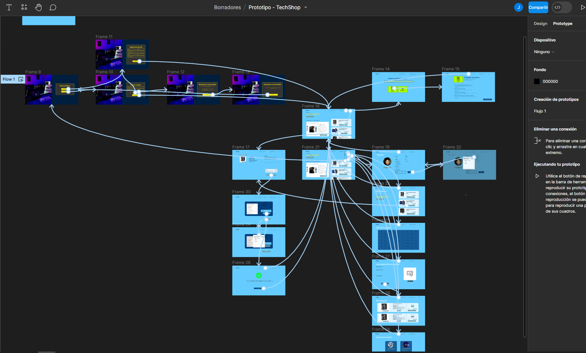
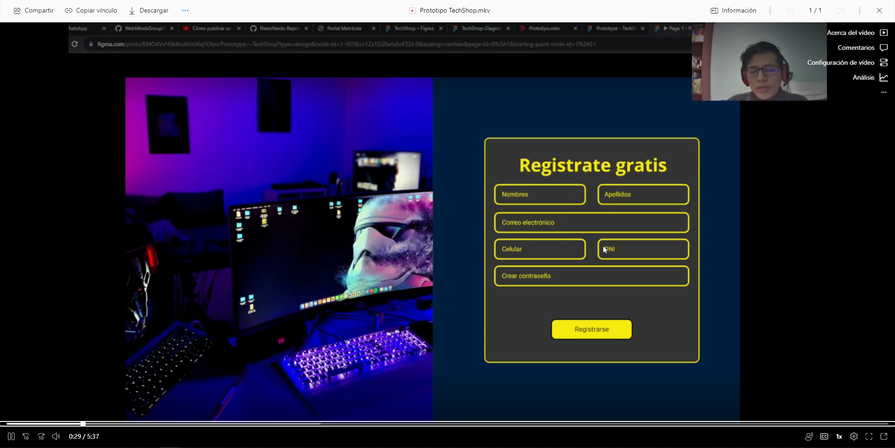
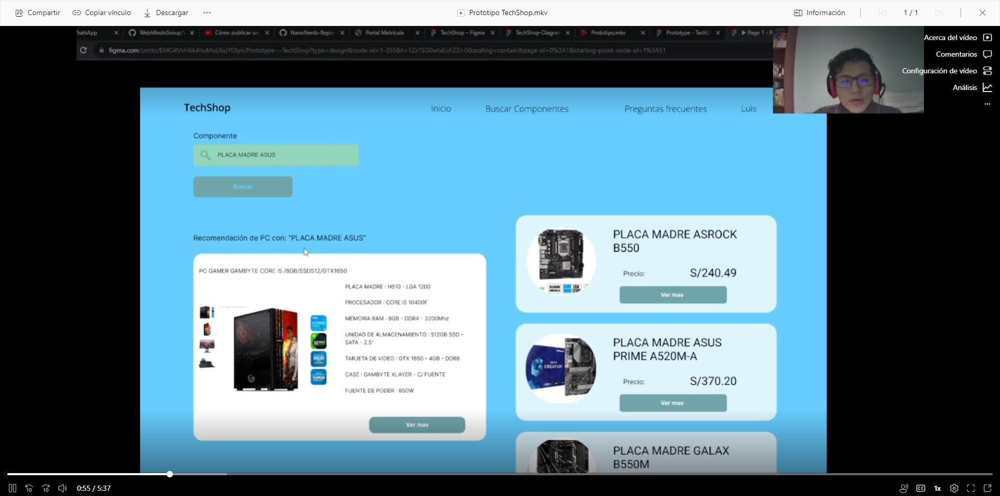
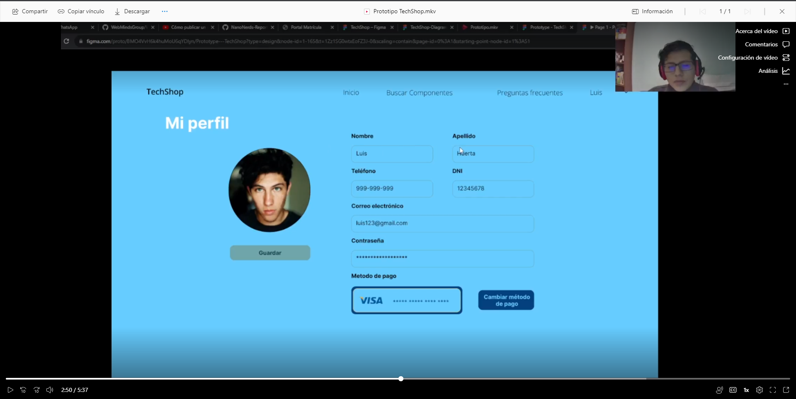
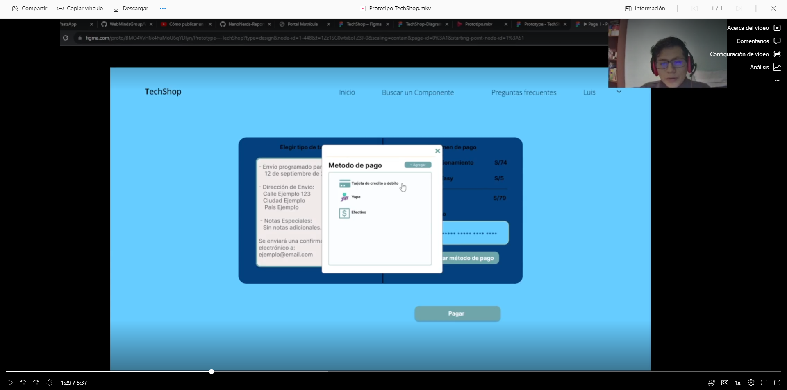

**4.5. Web Applications Prototyping.**

En esta sección, hemos desarrollado un prototipo de la aplicación web utilizando Figma. Además, se elaboró un video que permite una comprensión completa de la interfaz de la aplicación, destacando la ubicación de cada sección importante. Este prototipo incorpora los objetivos de usuario específicos de nuestros segmentos objetivo (Guest/Host).

**Link del prototipo: <https://www.figma.com/file/BMO4VvH6k4huMoU6qYDIyn/Prototype---TechShop?type=design&node-id=0%3A1&mode=design&t=1Zz1SG0wtxEoFZ3J-1>** 

**Link del video: <https://upcedupe-my.sharepoint.com/:v:/g/personal/u202124162_upc_edu_pe/EcXtN-bSh6RJkv9QDrzr_4cBmmHq53i-b7ZQmRq_RD--XQ?e=LWUOSH>** 

**Capturas de pantalla del video:**

- Apartado de Registro 

- Apartado de Búsqueda de Componentes

- Apartado de perfil

- Apartado de compras y método de pagos

