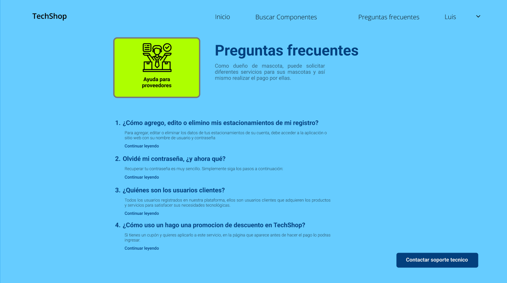

**4.4.2. Web Applications Mock-ups.**

User goal: Preferencia y gestión de cuenta de los usuarios.

- Registro de Sesión

- Inicio de Sesión

- Recuperar Contraseña

- Métodos de pago.

- Historial de pagos

User goal: Funcionalidades de Búsqueda para Componentes.

- Búsqueda de un componente.

- Navegación por favoritos.

User goal: Soporte al cliente y experiencia de servicio.

- Preguntas Frecuentes

User goal: Funcionalidad de Pagos

- Visualización y confirmación de pago.

- Suscripciones

