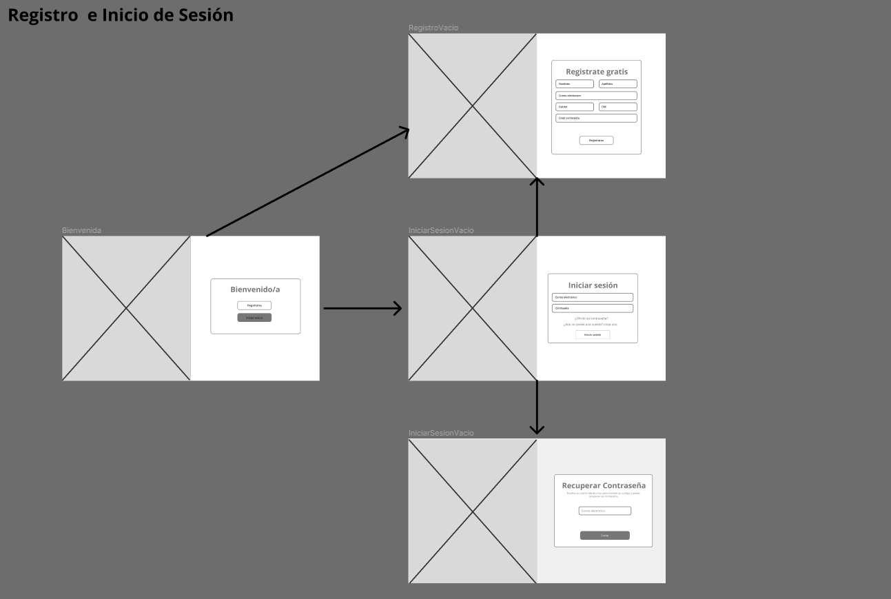
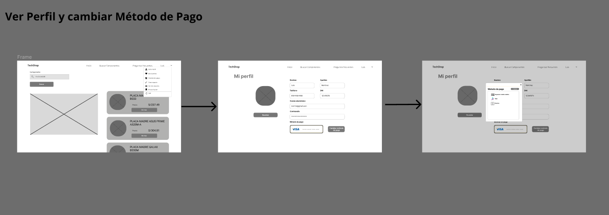
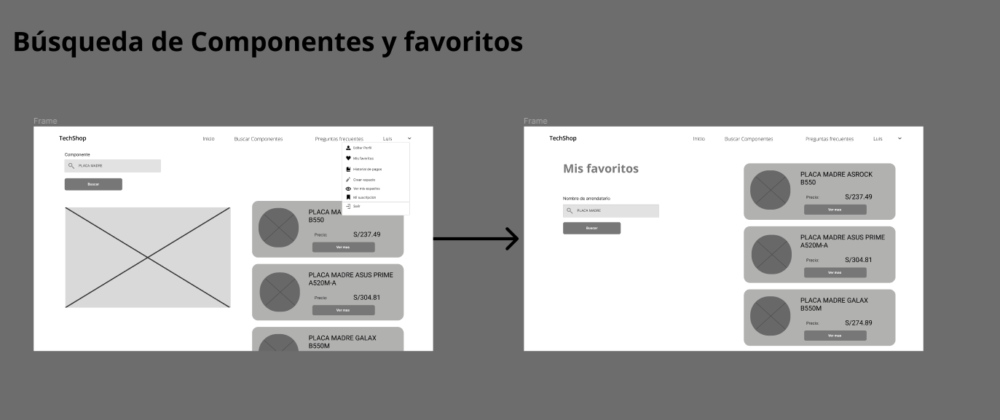
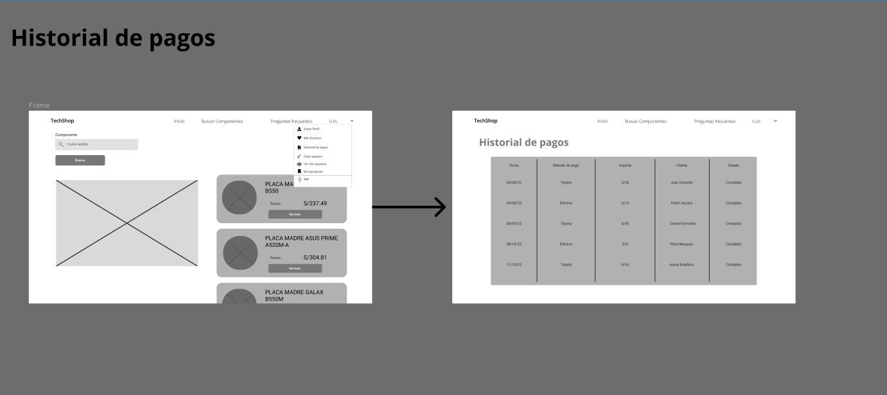
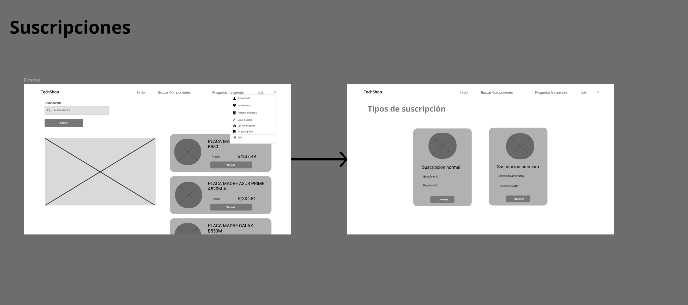
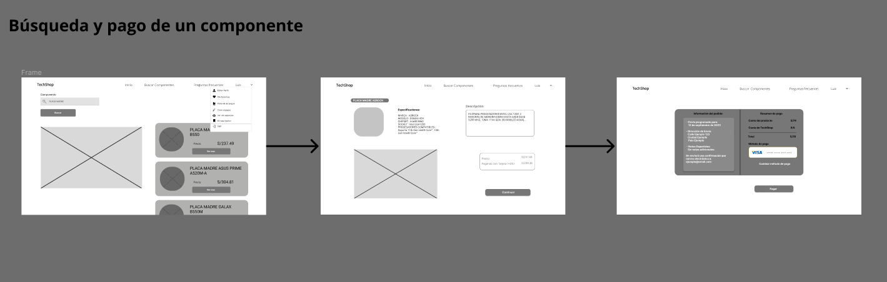

**4.4.2. Web Applications Wireflow Diagrams.**

User goal: Usuario se registra, inicia sesión o recupera su contraseña en la plataforma.

**Descripción:**

Al estar en la pestaña de bienvenida, el usuario tiene dos opciones: registrarse de manera gratuita rellenando el formulario con sus datos personales o iniciar sesión rellenando el formulario con su correo y contraseña. Además, puede recibir un correo para recuperar su contraseña si en caso se le olvidó.

**User goal: Preguntas frecuentes y contacto a Servicio Técnico.**

**Descripción:**

Al entrar en la pestaña de inicio, el usuario puede seleccionar la opción de preguntas frecuentes. El usuario puede seleccionar entre las preguntas frecuentes de vendedores o usuarios clientes. Si no consigue resolver sus dudas, puede contactar con soporte técnico.

**User goal: Editar perfil y cambiar métodos de pago.**

**Descripción:**

Al entrar en la pestaña de inicio, el usuario puede darle a su perfil y editar los datos necesarios. Asimismo, podrá cambiar sus métodos de pago

.

**User goal: Búsqueda de Componentes y visualización de favoritos.**

**Descripción:**

Al entrar en la pestaña de inicio, el usuario podrá buscar los componentes que quiera, además si le da a su nombre de usuario, visualizará la opción  de favoritos. Dentro de esta pestaña podrá ver los componentes que marcó como favoritos.

**User goal: Visualización del historial de pagos.**

**Descripción:**

Al entrar en la pestaña de inicio, el usuario puede seleccionar la pestaña con el nombre del usuario y entrar a historial de pagos. Dentro de la pestaña historial de pagos, el usuario puede visualizar los pagos que ha hecho con su respectiva fecha, método de pago, importe y nombre del vendedor.

**User goal: Visualización de Suscripciones.**

**Descripción:**

Al entrar en la pestaña de inicio, el usuario puede seleccionar la pestaña con el nombre del usuario y entrar a suscripciones. En este apartado el usuario tendrá la opción de escoger entre distintos tipos de suscripción para beneficios en la aplicación.

**User goal: Búsqueda y pago de componentes.**

**Descripción:**

Al entrar en la pestaña de inicio, el usuario puede buscar los componentes de su interés, al encontrar uno, podrá visualizar sus características, para posteriormente comprarlo.