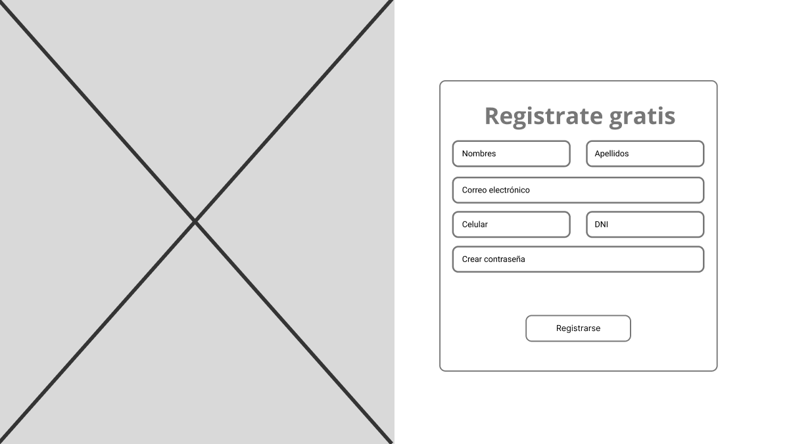
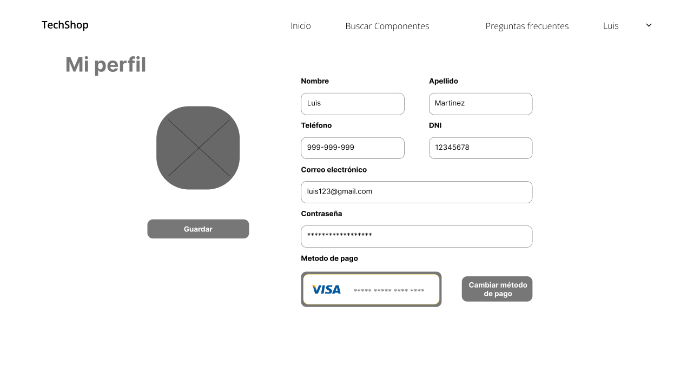

**4.4.1. Web Applications Wireframes.**

User goal: Preferencia y gestión de cuenta de los usuarios.

- Registro de sesión

- Inicio de sesión

- Recuperar Contraseña

- Métodos de pago

Descripción generada automáticamente](Aspose.Words.0c55bc50-9d83-42c3-8b47-ba9e0be4a04b.004.png)

- Historial de pagos

User goal: Funcionalidades de Búsqueda.

- Búsqueda de Componentes.

- Búsqueda de componentes en favoritos.

User goal: Mejora de soporte al cliente y experiencia de servicio.

- Acceso a Preguntas Frecuentes y contacto con Servicio Técnico.

User goal: Funcionalidad de pagos

- Visualización y confirmación de pago.

- Compra de suscripciones

User goal: Preferencia y gestión de cuenta

- Editar información del perfil del usuario y actualización de métodos de pago.

